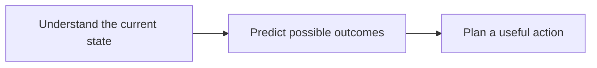
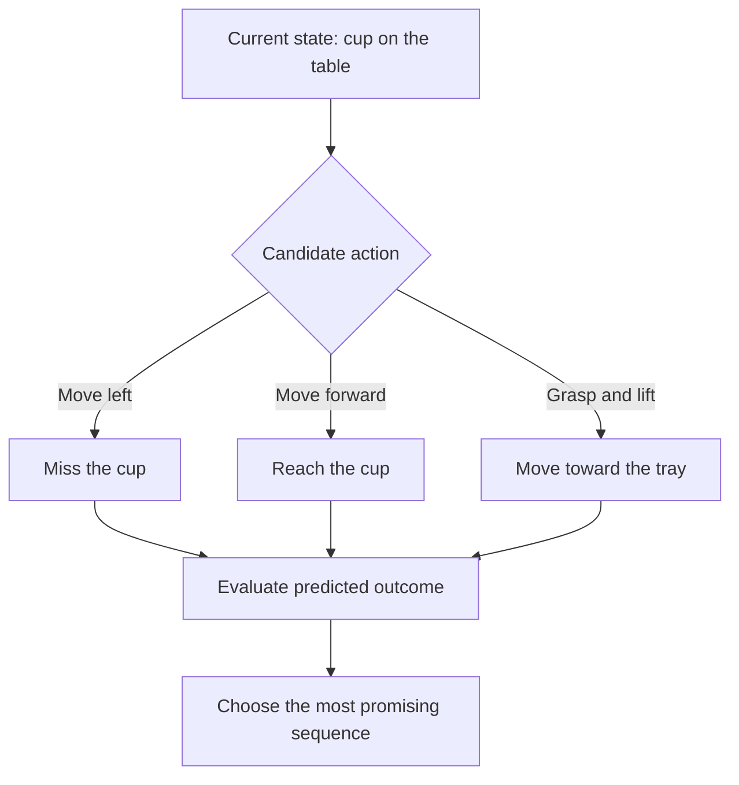
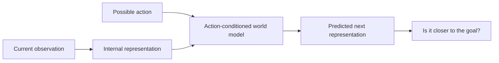
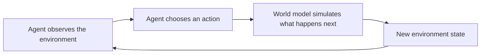
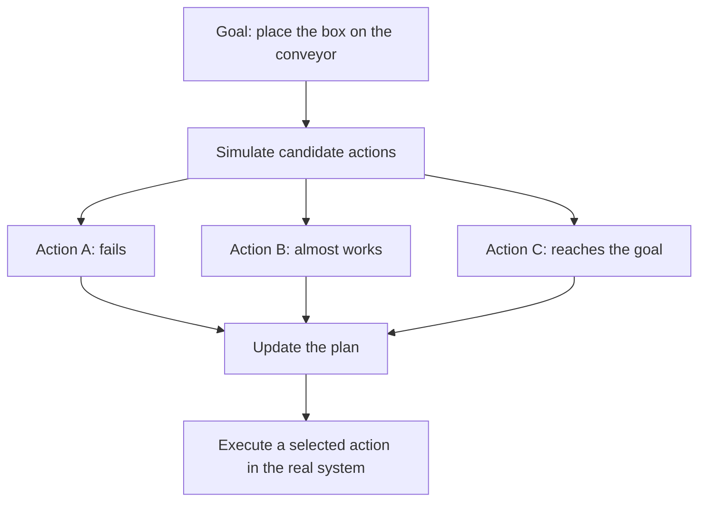
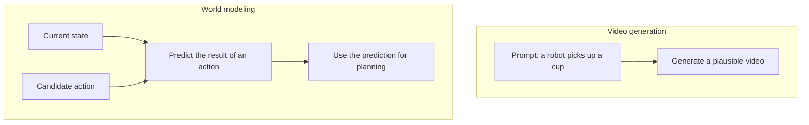
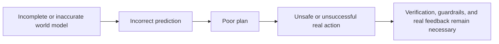
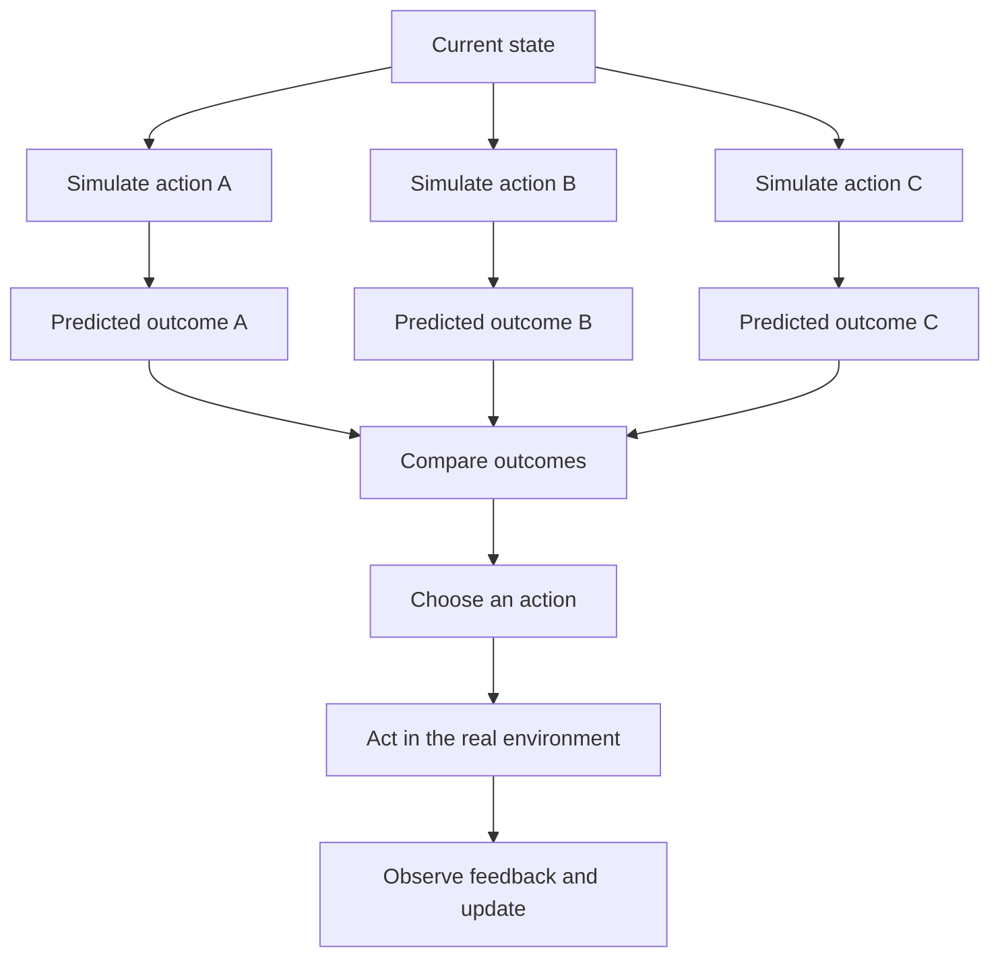

Imagine a robot standing in front of a cup near the edge of a table.

It has several options:

- push the cup;
- pick it up;
- pull it closer;
- do nothing.

Before acting, what if the robot could estimate:

> "If I push in this direction, the cup may fall."

> "If I grasp it here, I may be able to lift it."

It would have a better chance of choosing a useful action before touching anything.

Humans do something similar almost automatically. We see a ball thrown upward and expect it to come down. We see a glass tilt too far and anticipate a spill. We do not need to test every possibility in the physical world before recognizing likely consequences.

What if an AI system could learn a useful version of that ability?

That is the intuition behind **world models**.

## 1. What is a world model?

A practical definition is:

> **A world model helps an AI system represent how an environment changes and predict what may happen next, especially after an action.**

The "world" does not have to mean the entire planet. It can be a room, a robot workspace, a road scene, a video game, or any environment whose state changes over time.

Meta presents the goal behind V-JEPA 2 through three capabilities:



Suppose a robot sees a cup and has the goal of placing it in a tray. A planner can compare possible actions:



The model does not need to know the future with certainty. It needs predictions useful enough to distinguish better actions from worse ones.

## 2. "Imagine" is an analogy, not a claim that AI thinks like a person

When we say an AI can "imagine the future", we are using accessible language for a technical process.

The system does not necessarily see a movie inside its head. Some world models generate visible images or video, but others predict in an internal representation that people cannot directly view.

V-JEPA 2 is an example of the second approach. Instead of trying to reconstruct every pixel of a future video, the JEPA approach predicts important features in a learned representation space.



Why avoid predicting every pixel? Many visual details are difficult to predict but irrelevant to the task. The exact movement of a shadow may matter less than whether the robot hand is approaching the cup.

In the V-JEPA 2 work, the base model learned from more than one million hours of video. Its action-conditioned variant, V-JEPA 2-AC, was then trained with less than 62 hours of unlabeled robot video and used for zero-shot pick-and-place planning on robot arms in new lab environments.

That result is promising, but it is still a controlled research demonstration, not evidence that the model understands every physical situation.

## 3. Another kind of world model generates an environment you can enter

Google DeepMind's **Genie 3** makes the idea visually intuitive.

Genie 3 can generate an interactive environment from a text description. A person or Agent can move inside it while the model continues generating the world in response to actions.

For example, a prompt might describe:

> "A snow-covered road through the mountains."

The model creates the environment. As the user moves forward, it generates what comes next while trying to preserve the state and visual consistency of the world.



DeepMind describes world models as systems that simulate aspects of an environment so an Agent can predict how the world may evolve and how its actions may affect it.

Genie 3 currently generates 720p environments at roughly 20 to 24 frames per second and can maintain continuous interaction for a few minutes. This makes it more than a fixed video, but it is not a persistent, exact simulation of reality.

## 4. Why simulate instead of learning only through real-world trial and error?

Imagine training a factory robot to pick up a box, rotate it, and place it on a conveyor belt.

If every failed attempt happens in the real world, the robot may drop products, damage equipment, waste time, or create danger.

A simulator can allow the Agent to test possibilities before committing to a physical action:



Simulation has been used in robotics and reinforcement learning for years. The newer direction is to learn broader environment representations from large datasets such as video, rather than manually programming every object and physical rule for every scenario.

This does not eliminate real-world testing. It can reduce how much blind trial and error must happen in expensive or dangerous environments.

## 5. Are world models only for robots?

No. Robotics is simply the easiest example because the relationship between **action and consequence** is visible.

World models can be useful anywhere an AI system needs to reason about how an environment changes, including:

- robotics;
- autonomous systems;
- games;
- interactive simulation;
- training and evaluating Agents;
- planning in physical environments.

Generated environments can also expose an Agent to many scenarios that would be expensive, rare, or unsafe to recreate in reality.

The requirements differ across domains. A game world may prioritize visual consistency and interactive control. A robot planner may care more about object motion, contact, and goal completion. There is no single world model that automatically solves every kind of environment.

## 6. Is a world model the same as a video generator?

Not necessarily.

The two can overlap because both may generate images of what happens next. Their primary goals, however, can be different.

| | Video generator | World model for planning |
| --- | --- | --- |
| Typical input | A text, image, or video prompt | Current state, possible action, and sometimes a goal |
| Primary goal | Produce a plausible video | Predict how state changes after an action |
| Important property | Visual quality and prompt alignment | Action consistency and usefulness for decisions |
| Typical output | A video sequence | A future state, representation, trajectory, or simulated environment |



A system such as Genie 3 sits near the overlap: it generates visual environments while also making them controllable and responsive to actions.

The important distinction is not simply whether a model produces video. It is whether the model provides a state transition that an Agent can use to interact, learn, evaluate, or plan.

## 7. A world model is still a model, not a perfect copy of reality

It is tempting to imagine an AI simulating the world perfectly before it acts. Current systems are far from that.

DeepMind lists several limitations for Genie 3:

- the action space available to Agents remains limited;
- interactions among multiple independent Agents are difficult to model accurately;
- real locations are not reproduced with perfect accuracy;
- legible text remains difficult unless it is included in the prompt;
- continuous interaction lasts minutes rather than hours.

More generally, any world model can fail when it encounters unfamiliar objects, rare events, hidden variables, or physical interactions that its learned representation does not capture.



If a model predicts that action A is safe while the real action is dangerous, the Agent can still fail.

So a world model should not be treated as an oracle. It is a prediction mechanism with a scope, an error distribution, and assumptions that must be tested.

## 8. From reacting after an action to predicting before it

Many simple Agents operate reactively:

```text
Act -> observe the result -> adjust
```

A world model can add a planning step before the external action:



The shift is from always **acting before knowing** toward being able to **predict before acting**.

That is why world models receive so much attention in robotics and embodied AI. An Agent operating in the world needs more than recognition of what is happening now. It also benefits from a useful estimate of what may happen next.

This does not mean AI has acquired human imagination. It means a system can learn predictive structure that supports decisions.

Across the previous articles, we have seen different components take different roles:

- reasoning models analyze difficult problems;
- [System-1-like models](../system-1-vs-system-2-in-ai/) make narrow, fast decisions;
- Agents choose actions and use tools;
- [memory](../why-ai-forgets-memory/) carries relevant information across time;
- world models estimate how an environment may change.

This leads to the next question:

> **Will the future use one enormous model to do all of this, or will different models specialize in different parts of the system?**

That is the next story.

## References

- [Meta AI - Introducing V-JEPA 2](https://ai.meta.com/research/vjepa/)
- [V-JEPA 2 research paper](https://arxiv.org/abs/2506.09985)
- [Google DeepMind - Genie 3](https://deepmind.google/models/genie/)
- [Google DeepMind - Genie 3: A new frontier for world models](https://deepmind.google/blog/genie-3-a-new-frontier-for-world-models/)
- [World Models research paper](https://arxiv.org/abs/1803.10122)
