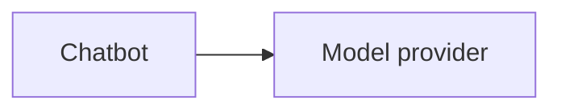
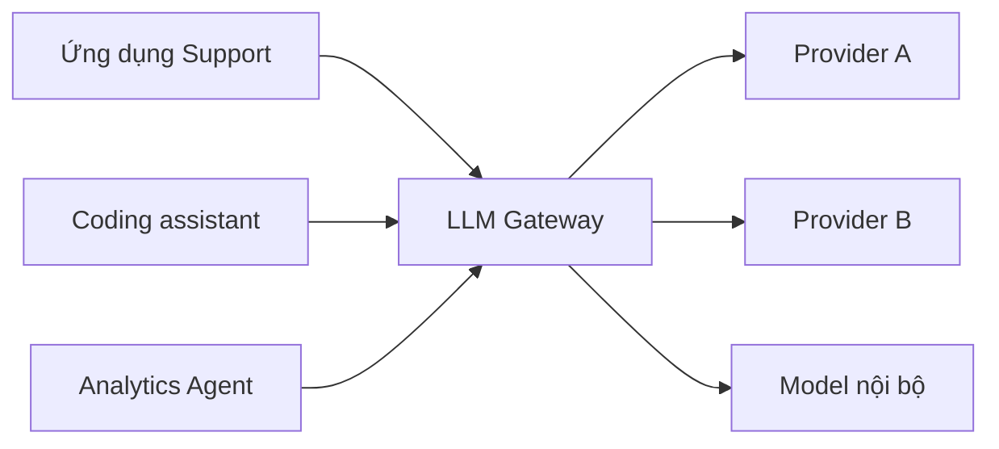
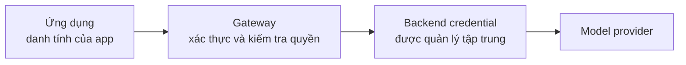
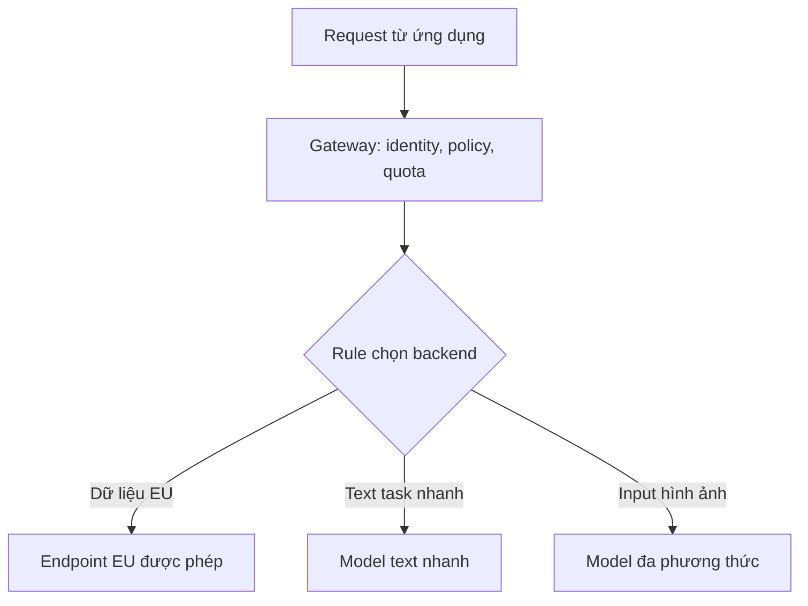
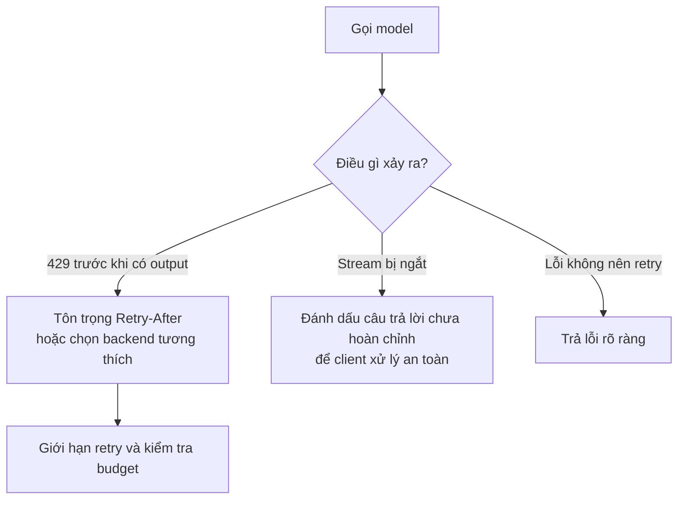
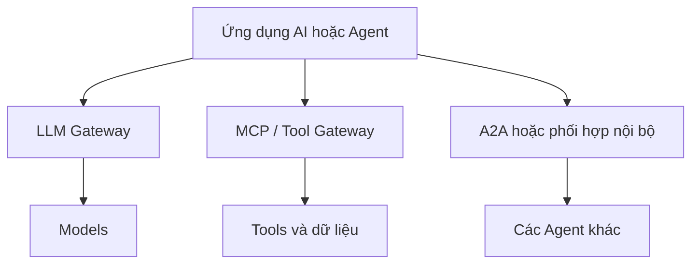

Một ứng dụng gọi thẳng model provider có thể hoàn toàn hợp lý. Câu hỏi chỉ thay đổi khi công ty có hàng chục ứng dụng, nhiều provider, nhưng không ai còn biết team nào đang dùng model nào và token đang được tiêu ở đâu.

Hãy tưởng tượng lúc đầu công ty chỉ có một chatbot:

Backend giữ API key, gửi request và nhận câu trả lời. Sáu tháng sau, team Support có trợ lý riêng, Engineering có công cụ viết code, Data có Agent phân tích, còn nhiều nhóm đang thử những model khác nhau. Mỗi team lại tự quản lý credential, retry, rate limit, log usage và policy.

Từng ứng dụng vẫn có thể chạy tốt. Nhưng ở cấp công ty, ai đang kiểm soát tất cả những kết nối này?

**LLM Gateway** là một cách giải: đặt một lớp truy cập chung giữa các ứng dụng và những model endpoint. Tên "AI Gateway" thường được dùng cho lớp rộng hơn, có thể quản lý thêm tools hoặc Agents. Cả hai tên gọi đều không đảm bảo một bộ tính năng cố định.

## 1. Ý tưởng Gateway không mới

API gateway truyền thống đặt các cơ chế dùng chung giữa client và service. LLM Gateway áp dụng cách nghĩ tương tự cho việc truy cập model:

Gateway có thể trở thành nơi dùng chung cho authentication, routing, giới hạn sử dụng, policy và telemetry. [AWS mô tả generative AI gateway như phần mở rộng của pattern API gateway](https://aws.amazon.com/blogs/machine-learning/create-a-generative-ai-gateway-to-allow-secure-and-compliant-consumption-of-foundation-models/), phù hợp hơn với việc doanh nghiệp dùng nhiều foundation model.

Từ quan trọng ở đây là **có thể**. Gateway nhỏ có khi chỉ quản lý credential và logging. Platform lớn hơn có thể thêm routing, quota, guardrail và cache. Chỉ đặt một proxy ở giữa không tự tạo ra tất cả những tính năng đó.

## 2. Đưa provider credential ra sau một ranh giới

Không có gateway, mỗi ứng dụng có thể cần một credential riêng để gọi provider. Các credential này phải được tạo, lưu, rotate, thu hồi và audit ở nhiều team.

Với gateway, ứng dụng xác thực *với gateway*. Gateway mới giữ hoặc lấy backend credential để gọi model endpoint được phép. Một team có thể được quyền dùng model mà không cần biết secret của provider.

Cách này tập trung một ranh giới bảo mật, nhưng không loại bỏ việc bảo vệ danh tính ứng dụng, chặn đường gọi trực tiếp khi cần, rotate secret và audit. Nếu các team vẫn có thể đi vòng qua gateway, gateway không còn là điểm thực thi policy đáng tin cậy.

## 3. Interface chung giảm việc tích hợp lặp lại

API của các provider khác nhau về request format, authentication, streaming, lỗi, tên model và usage metadata. Gateway *có thể* đưa ra một interface chung rồi chuyển đổi request ở phía sau. Nhờ đó, thử provider mới ít ảnh hưởng hơn tới code của từng ứng dụng.

Uber là một ví dụ thực tế. Họ cho biết đã xác định hơn 60 use case GenAI và xây [GenAI Gateway](https://www.uber.com/us/en/blog/genai-gateway/) để cung cấp interface nhất quán tới model bên ngoài lẫn model do Uber host, thay vì để các team lặp lại việc integration.

Nhưng endpoint chung không có nghĩa mọi model thay thế được cho nhau. Tool calling, input hình ảnh, structured output, context length, safety behavior và streaming có thể khác nhau. Gateway nên báo rõ tính năng không được hỗ trợ và trả lỗi có ý nghĩa, thay vì giả vờ những khác biệt đó đã biến mất.

## 4. Gateway là điểm kiểm soát, không chỉ là adapter đổi API

Khi model traffic đi qua một nơi, công ty có thể trả lời những câu hỏi từng rất khó khi các app gọi riêng lẻ:

| Câu hỏi | Dữ liệu gateway có thể ghi nhận |
| --- | --- |
| Ai đang dùng model? | Danh tính ứng dụng, team hoặc user |
| Đang dùng bao nhiêu tài nguyên? | Số request và token |
| Trải nghiệm có ổn không? | Latency, lỗi, throttling |
| Request đi đâu? | Provider, deployment, phiên bản model |

Những dữ liệu này hữu ích cho monitoring và phân bổ chi phí, nhưng ước tính từ gateway không tự động trùng với hóa đơn cuối cùng của provider. Giá, cached token, điều chỉnh của provider hoặc usage data bị thiếu đều có thể ảnh hưởng số liệu.

[Tài liệu AI gateway của Microsoft](https://learn.microsoft.com/en-us/azure/api-management/genai-gateway-capabilities) liệt kê token limit, routing, observability, security và governance trong số những capability có thể đặt ở ranh giới này.

## 5. Rate limit của LLM không chỉ tính số request

Với API thông thường, giới hạn requests per minute đôi khi đã đủ. Nhưng một request LLM có thể dùng vài trăm token, request khác lại dùng hàng chục nghìn. Cần quan tâm cả số request lẫn lượng token tiêu thụ.

Giả sử ba team dùng chung một deployment. Batch job lớn của Team A có thể chiếm phần lớn capacity, khiến traffic tương tác của Team B và C bị throttling. Gateway có thể áp giới hạn request hoặc token theo team và trả tín hiệu rõ khi chạm giới hạn.

[Chính sách LLM token-limit của Azure API Management](https://learn.microsoft.com/en-us/azure/api-management/llm-token-limit-policy) là một ví dụ. Nó có thể giới hạn tokens per minute hoặc đặt quota dựa trên một counter key. Cách tính cụ thể còn phụ thuộc việc ước lượng prompt token và đọc usage từ response, vì vậy cần thử với traffic thật.

## 6. Routing là một khả năng của Gateway, không phải định nghĩa của nó

Router trả lời câu hỏi: **Request này nên đi đâu?** Nó có thể dựa trên rule rõ ràng như khu vực dữ liệu, capability của model, policy của tenant hoặc tình trạng backend. Routing nâng cao có thể xét độ khó của task, nhưng khi đó chính quyết định routing cũng cần được đánh giá.

Gateway trả lời câu hỏi rộng hơn: **Request phải đi qua những cơ chế kiểm soát chung nào?**

Gateway không có semantic routing vẫn có thể rất hữu ích. Tương tự, tự động chọn model rẻ nhất chưa chắc là tối ưu. Mục tiêu hợp lý là giảm chi phí **trong khi giữ chất lượng task ở mức chấp nhận được**, được đo trên workload thực của ứng dụng.

## 7. Fallback không phải "hễ lỗi là gọi model khác"

Nếu provider trả 429 trước khi bắt đầu generate, đợi rồi retry hoặc chuyển sang endpoint khỏe và tương thích có thể hợp lý. Nhưng nếu response đã stream gần hết câu trả lời rồi connection mới đứt, lặng lẽ chạy lại từ đầu với model khác có thể tạo nội dung trùng hoặc mâu thuẫn với phần user đã thấy.

Model dự phòng cũng có thể thiếu capability của model ban đầu. Cần xét phiên bản model, tool support, output format, khu vực dữ liệu và policy trước khi fallback.

[Hướng dẫn kiến trúc của Microsoft](https://learn.microsoft.com/en-us/azure/architecture/ai-ml/guide/azure-openai-gateway-multi-backend) khuyên tôn trọng Retry-After và dùng circuit breaker, thay vì liên tục gửi request tới backend đang bị throttling. Những hành động có tác dụng phụ, chẳng hạn tool hoàn tiền trong workflow của Agent, còn cần cơ chế idempotency và approval ở application layer; riêng model gateway không thể khiến chúng an toàn.

## 8. Observability hữu ích, nhưng "log tất cả" rất nguy hiểm

Gateway chung có thể ghi số request, latency, lỗi, token usage và backend được chọn trên toàn bộ các team. Nhờ đó dễ trả lời "Team nào đang tiêu bao nhiêu?" và "Traffic đang lỗi ở đâu?"

Nhưng prompt và completion có thể chứa dữ liệu cá nhân, hồ sơ khách hàng, tài liệu nội bộ, source code hoặc secret. Log nguyên văn mặc định có thể biến hệ thống monitoring thành một kho dữ liệu nhạy cảm mới. Cần chọn nội dung được log, che dữ liệu nhạy cảm, giới hạn quyền xem, sampling khi phù hợp và đặt thời hạn lưu trữ.

Gateway quan sát được model traffic thực sự đi qua nó. Nó không tự giải thích toàn bộ lỗi của Agent. Để debug retrieval, tools, handoff và business decision, hãy liên kết gateway telemetry với trace của ứng dụng.

## 9. Policy tập trung không thay thế bảo mật ứng dụng

Gateway có thể áp rule chung như "Team A được dùng các model này", "tenant này có token budget", hoặc "dữ liệu nhạy cảm chỉ đi tới endpoint được duyệt". Nó cũng có thể gọi guardrail ở đầu vào và đầu ra.

Điều đó không có nghĩa **gateway** và **guardrail** là một. Gateway là nơi kiểm soát; guardrail là một phép kiểm tra có thể chạy ở đó. Gateway cũng không nên quyết định một khách hàng cụ thể có đủ điều kiện hoàn tiền không. Đó là business logic của ứng dụng.

Việc phân loại dữ liệu cũng có thể sai. Nếu routing phụ thuộc vào việc dữ liệu có nhạy cảm không, phải thiết kế và kiểm thử cả cách hệ thống xử lý khi phân loại thất bại. Policy ở gateway còn giả định rằng ứng dụng không thể âm thầm đi vòng qua nó.

## 10. Model access, tool access và Agent communication là ba việc khác nhau

LLM Gateway chủ yếu ở **phía model**: ứng dụng gửi request inference tới model endpoint. MCP hoặc Tool Gateway, nếu có, quản lý truy cập **tools và dữ liệu**. A2A giải quyết **giao tiếp Agent với Agent**.

Những ranh giới này có thể cùng tồn tại, và một số sản phẩm kết hợp chúng. [Tài liệu AI gateway của Microsoft](https://learn.microsoft.com/en-us/azure/api-management/genai-gateway-capabilities) hiện mô tả việc quản lý model APIs, remote MCP servers và A2A Agent APIs trong cùng một platform. Nhưng về mặt khái niệm, gọi model, gọi tool và giao việc cho Agent khác vẫn là ba thao tác khác nhau. Có thể xem lại hai bài về [MCP](../what-is-mcp-ai-usb-c-vi/) và [multi-agent](../multi-agent-architecture-vi/) để nối các mảnh ghép.

## 11. Caching có thể tiết kiệm, nhưng cũng có thể gây lỗi nghiêm trọng

Nếu hàng nghìn user cùng hỏi một câu FAQ công khai và ít thay đổi, tái sử dụng câu trả lời có thể giảm latency và số lần gọi model. Một số gateway hỗ trợ **semantic caching**, tức là prompt có ý nghĩa gần nhau vẫn có thể dùng lại kết quả dù câu chữ khác; [Azure API Management có tài liệu cho tính năng này](https://learn.microsoft.com/en-us/azure/api-management/azure-openai-enable-semantic-caching).

Giờ hãy thay FAQ bằng câu "Số dư tài khoản của tôi là bao nhiêu?" Trả câu trả lời cache của user A cho user B sẽ là rò rỉ dữ liệu nghiêm trọng. Còn câu "Giá hiện tại là bao nhiêu?" có thể trở nên lỗi thời rất nhanh.

Trước khi cache, cần hỏi response có phụ thuộc danh tính user, quyền truy cập, thời điểm, tài liệu vừa retrieval, phiên bản prompt, phiên bản model hay trạng thái cuộc hội thoại không. Hãy tách cache key phù hợp, đặt thời gian sống hợp lý và bỏ qua cache khi không thể chứng minh việc tái sử dụng là an toàn.

## 12. Đừng biến Gateway thành "God Service"

Khi đã có gateway chung, ta rất dễ muốn nhét mọi thứ vào đó: prompt management, RAG, Agent planning, memory, business rule, evaluation và tool execution. Kết quả là một service khó thay đổi và khó hiểu.

Một cách chia trách nhiệm hữu ích:

| Application layer | Gateway layer |
| --- | --- |
| Mục tiêu người dùng và business logic | Danh tính và quyền truy cập |
| Agent workflow và quyết định dùng tool | Quota và routing dùng chung |
| RAG và bằng chứng theo domain | Provider credentials và telemetry |
| Approval theo nghiệp vụ | Thực thi policy dùng chung |

Ranh giới cụ thể tùy tổ chức. Nguyên tắc là chia sẻ những cơ chế có tính xuyên suốt mà không kéo mọi quyết định sản phẩm vào hạ tầng chung.

## 13. Tập trung hóa cũng tạo ra một dependency chung

Nếu mọi ứng dụng đều phụ thuộc một gateway và gateway bị down, tất cả có thể mất khả năng gọi model. Gateway cần được vận hành như service quan trọng: tính capacity, dự phòng, theo dõi health, đặt timeout và có phương án phục hồi.

Ngay cả gateway đang chạy tốt cũng thêm một network hop và thêm một nơi có thể cấu hình sai. Cần thiết kế deployment và chính sách đi vòng một cách chủ động. "Gateway có high availability" là yêu cầu kiến trúc, không phải đặc tính tự có của tên gọi "gateway".

## 14. Khi nào project thực sự cần LLM Gateway?

Với một ứng dụng, một provider và một team nhỏ, gọi trực tiếp thường đơn giản hơn. Thêm gateway đồng nghĩa thêm deployment, công vận hành và có thể thêm latency.

Hãy cân nhắc gateway khi nhiều tín hiệu cùng xuất hiện:

- Nhiều ứng dụng hoặc team đang lặp lại việc tích hợp provider.
- Cần quản lý tập trung credential và quyền dùng model.
- Khó theo dõi usage, phân bổ chi phí hoặc quota theo team.
- Cần routing và xử lý lỗi nhất quán.
- Yêu cầu về khu vực dữ liệu, compliance hoặc audit tăng lên.

Phiên bản đầu có thể chỉ cần endpoint chung, credential được quản lý, authentication và telemetry hữu ích. Hãy thêm token limit, routing, fallback hoặc caching khi có vấn đề thật đã đo được.

## Gateway là lễ tân, không phải CEO

Ứng dụng vẫn quyết định mình giải quyết bài toán gì. Agent vẫn chọn bước tiếp theo trong giới hạn runtime. RAG vẫn tìm bằng chứng liên quan. Gateway kiểm soát **việc truy cập model được cho phép và vận hành như thế nào** trên nhiều ứng dụng.

Nó không làm model thông minh hơn. Nó giúp việc sử dụng model ở quy mô lớn dễ kiểm soát hơn.

Bên dưới gateway còn một lớp mà bài này gần như xem là hộp đen. Khi hàng nghìn request tới model service, chúng phải xếp hàng, được lập lịch, gom batch và chia GPU memory. Đó là nơi những vấn đề như throughput và KV cache bắt đầu xuất hiện, nằm sâu hơn tầng application architecture chúng ta vừa bàn.

