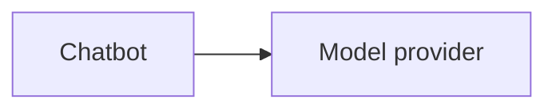
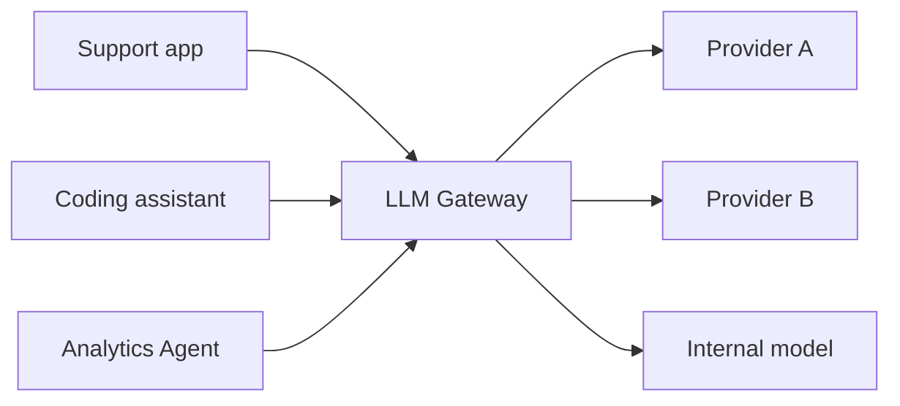
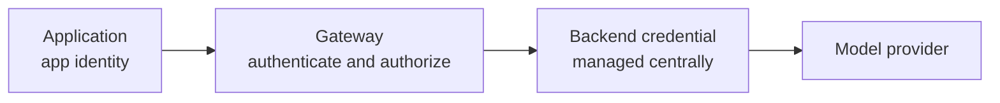
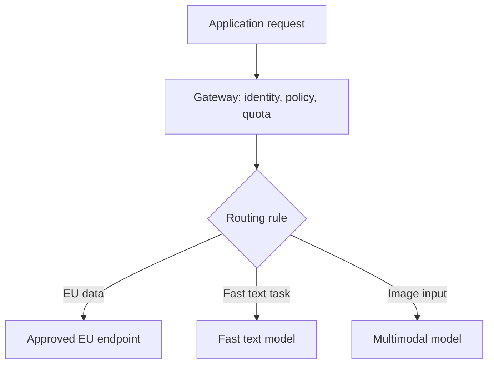
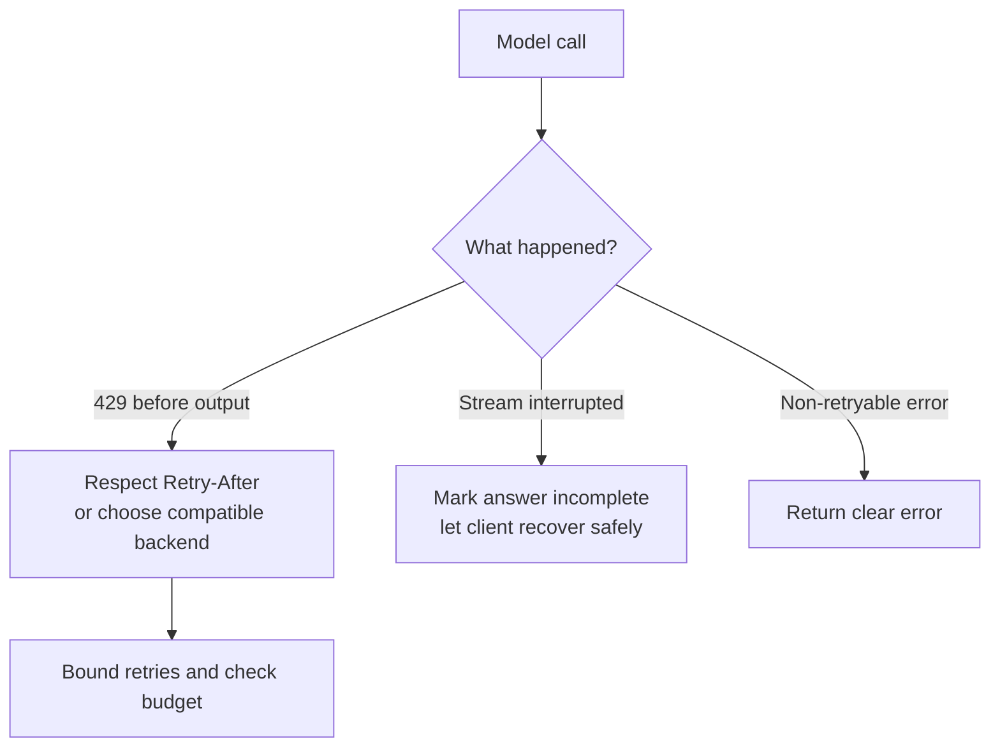
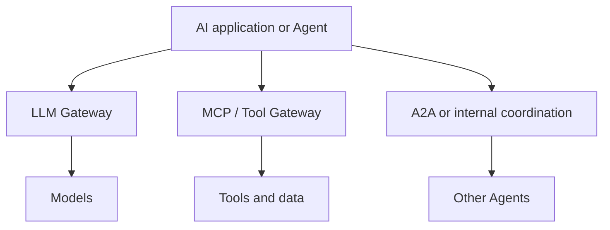

One application calling a model provider directly can be perfectly sensible. The question changes when a company has dozens of applications, several providers, and no clear picture of who is using which model or where the tokens are going.

Imagine starting with one chatbot:

The backend holds an API key, sends a request, and receives an answer. Six months later, Support has an assistant, Engineering has a coding tool, Data has an analysis Agent, and several teams are experimenting with different models. Each team now handles credentials, retries, rate limits, usage logs, and policies on its own.

Each application may still work. At the organization level, though, who controls all those connections?

An **LLM Gateway** is one possible answer: a shared access layer between applications and model endpoints. "AI Gateway" is often used for a broader layer that may also govern tools or Agents. Neither name guarantees a fixed feature set.

## 1. The idea is older than LLMs

Traditional API gateways put common controls between clients and services. An LLM Gateway applies a similar pattern to model access:

The gateway can become a common place for authentication, routing, limits, policy, and telemetry. [AWS describes the generative AI gateway as an extension of the API gateway pattern](https://aws.amazon.com/blogs/machine-learning/create-a-generative-ai-gateway-to-allow-secure-and-compliant-consumption-of-foundation-models/), adapted for enterprise use of foundation models.

The important word is **can**. A small gateway might offer only credential management and logging. A larger platform might add routing, quotas, guardrails, and caching. None of these features is automatic just because a proxy sits in the middle.

## 2. Keep provider credentials behind a boundary

Without a gateway, every application may need its own provider credential. Those credentials must be issued, stored, rotated, revoked, and audited across teams.

With a gateway, applications authenticate *to the gateway*. The gateway holds or obtains the backend credentials and calls the approved model endpoint. A team can have permission to use a model without receiving the provider secret itself.

This centralizes one security boundary, but it does not remove the need to protect application identities, restrict direct egress where appropriate, rotate secrets, and audit access. A gateway that teams can bypass is not a reliable enforcement point.

## 3. A shared interface can reduce repeated integration work

Provider APIs differ in request shapes, authentication, streaming, errors, model names, and usage metadata. A gateway *may* expose a common interface and translate requests behind it. That can make a provider experiment less disruptive to client code.

Uber provides a concrete example: it reported more than 60 generative AI use cases and built a [GenAI Gateway](https://www.uber.com/us/en/blog/genai-gateway/) to offer a consistent interface to external and Uber-hosted models, instead of making teams repeat integrations.

But a common endpoint does not mean every model is interchangeable. Tool calling, image input, structured output, context length, safety behavior, and streaming semantics may differ. The gateway should surface unsupported capabilities and meaningful errors, not pretend those differences have disappeared.

## 4. A gateway is a control point, not just an API adapter

Once model traffic passes through one place, the organization can ask questions that were difficult to answer across separate apps:

| Question | Signal the gateway can capture |
| --- | --- |
| Who is using models? | Application, team, or user identity |
| How much capacity is used? | Request and token counts |
| Is the experience healthy? | Latency, failures, throttling |
| Which backend is used? | Provider, deployment, model version |

These signals are useful for monitoring and cost allocation, but gateway-side estimates are not automatically identical to a provider's final bill. Pricing, cached tokens, provider adjustments, and missing usage data can complicate accounting.

[Microsoft's AI gateway documentation](https://learn.microsoft.com/en-us/azure/api-management/genai-gateway-capabilities) lists token limits, routing, observability, security, and governance as examples of capabilities that can live at this boundary.

## 5. LLM limits need more than requests per minute

For an ordinary API, limiting requests per minute may be enough. With an LLM, one request may use a few hundred tokens and another may use tens of thousands. Both request count and token consumption matter.

Suppose three teams share one deployment. A large batch job from Team A can consume most available capacity, leaving interactive traffic from Teams B and C throttled. A gateway can enforce per-team request or token limits and return clear signals when a limit is reached.

[Azure API Management's LLM token-limit policy](https://learn.microsoft.com/en-us/azure/api-management/llm-token-limit-policy) is an example of this approach. It can limit tokens per minute or enforce a quota using a chosen counter key. The exact accounting depends on how the policy estimates prompt tokens and reads usage from responses, so limits should be tested under real traffic.

## 6. Routing is a feature a gateway may have, not its definition

A router answers: **Where should this request go?** It may use explicit rules such as region, model capability, tenant policy, or backend health. More advanced routing might consider task complexity, but then the routing decision itself needs evaluation.

A gateway answers a wider question: **Which common controls must this request pass through?**

A gateway with no semantic routing can still be valuable. Likewise, choosing the cheapest model is not automatically an optimization. The useful target is lower cost **while preserving acceptable task quality**, measured on the application's workload.

## 7. Fallback is not "on any error, call another model"

If a provider returns a 429 before generation starts, retrying later or choosing a compatible healthy endpoint may make sense. If a streamed response has already delivered most of its answer, silently restarting on another model can duplicate or contradict what the user saw.

A fallback model may also lack the original model's required capabilities. Treat model version, tool support, output format, data residency, and policy as compatibility constraints.

[Microsoft's architecture guidance](https://learn.microsoft.com/en-us/azure/architecture/ai-ml/guide/azure-openai-gateway-multi-backend) recommends respecting Retry-After and using circuit breakers rather than repeatedly hitting a throttled backend. Side-effecting operations, such as a refund tool call somewhere in an Agent workflow, need an additional application-level idempotency and approval strategy; a model gateway alone cannot make them safe.

## 8. Observability is valuable, but "log everything" is dangerous

A central gateway can record request volume, latency, errors, token usage, and backend selection across teams. That helps answer "Who is spending what?" and "Where is traffic failing?"

But prompts and completions may contain personal data, customer records, internal documents, source code, or secrets. Logging raw content by default can turn the monitoring system into a new sensitive-data store. Choose what to log, redact sensitive fields, restrict access, sample where appropriate, and define retention periods.

A gateway can observe model traffic that actually passes through it. It cannot explain an entire Agent failure on its own. To debug retrieval, tools, handoffs, and business decisions, correlate gateway telemetry with application traces.

## 9. Central policy does not replace application security

A gateway can apply broad rules such as "Team A may use these models", "this tenant has a token budget", or "sensitive data stays on approved endpoints". It can also invoke input or output guardrails.

That does not make **gateway** and **guardrail** the same thing. The gateway is a control location; a guardrail is one check that can run there. Nor should the gateway decide whether a specific customer qualifies for a refund. That is application business logic.

Content classification can be imperfect, too. If routing depends on whether data is sensitive, the classification and its failure behavior must be designed and tested. A policy enforced only at the gateway also assumes applications cannot quietly bypass it.

## 10. Model access, tool access, and Agent communication are distinct

An LLM Gateway primarily sits on the **model side**: an application requests an inference from a model endpoint. An MCP or Tool Gateway, where present, governs access to **tools and data**. A2A concerns **Agent-to-Agent communication**.

These boundaries can coexist, and products may combine them. [Microsoft's AI gateway documentation](https://learn.microsoft.com/en-us/azure/api-management/genai-gateway-capabilities) now describes support for model APIs, remote MCP servers, and A2A Agent APIs in one platform. Conceptually, though, calling a model, invoking a tool, and delegating to another Agent remain different operations. See the earlier [MCP](../what-is-mcp-ai-usb-c/) and [multi-agent](../multi-agent-architecture/) articles for the other two sides.

## 11. Caching can save money and create serious mistakes

If thousands of users ask the same public, stable FAQ, reusing a response may reduce latency and model usage. Some gateways support **semantic caching**, where similar prompts can match even if their wording differs; [Azure API Management documents this capability](https://learn.microsoft.com/en-us/azure/api-management/azure-openai-enable-semantic-caching).

Now replace the FAQ with "What is my account balance?" Returning one user's cached answer to another would be a serious data leak. A cached answer to "What is the current price?" may simply be stale.

Before caching, ask whether the response depends on user identity, permissions, time, retrieved documents, prompt version, model version, or conversation state. Partition cache keys appropriately, set a sensible lifetime, and bypass caching when safe reuse cannot be established.

## 12. Do not turn the gateway into a "god service"

Once there is a shared gateway, it is tempting to move everything there: prompt management, RAG, Agent planning, memory, business rules, evaluation, and tool execution. That creates a service that is difficult to change or understand.

A useful division of responsibility is:

| Application layer | Gateway layer |
| --- | --- |
| User intent and business logic | Identity and access rules |
| Agent workflow and tool decisions | Shared quotas and routing |
| RAG and domain-specific evidence | Provider credentials and telemetry |
| Domain-specific approval | Cross-cutting policy enforcement |

The exact boundary will vary by organization. The principle is to keep cross-cutting controls shared without pulling every product decision into central infrastructure.

## 13. Centralization also creates a shared dependency

If all applications depend on one gateway and that gateway is down, all model access may fail. The gateway needs the same production care as any critical service: capacity planning, redundancy, health monitoring, bounded timeouts, and a recovery plan.

Even a healthy gateway adds another network hop and another place where configuration can go wrong. Design the deployment and bypass policy deliberately. "Highly available gateway" is an architectural requirement, not a property of the word "gateway".

## 14. When is an LLM Gateway worth it?

For one application, one provider, and a small team, direct calls are often simpler. Adding a gateway brings deployment, operational cost, and possible latency.

Consider one when several of these pressures appear together:

- Multiple applications or teams are repeating provider integrations.
- Credentials and model access need centralized control.
- Usage, cost allocation, or quota per team is hard to see.
- Routing and failure handling must be consistent.
- Data residency, compliance, or audit requirements have grown.

A practical first version may need only a shared endpoint, managed credentials, authentication, and useful telemetry. Add token limits, routing, fallback, or caching when a measured problem justifies them.

## A gateway is the receptionist, not the CEO

Applications still decide what problem they solve. Agents still choose their next steps within their runtime. RAG still retrieves relevant evidence. The gateway governs **how model access is allowed and operated** across those applications.

It does not make the model smarter. It makes model use at scale easier to control.

And below the gateway sits another layer we have mostly treated as a black box. When thousands of requests reach a model service, they must be queued, scheduled, batched, and fitted into GPU memory. That is where serving concerns such as throughput and KV cache begin, beyond the application architecture discussed here.

## References

- [Create a generative AI gateway - AWS Machine Learning Blog](https://aws.amazon.com/blogs/machine-learning/create-a-generative-ai-gateway-to-allow-secure-and-compliant-consumption-of-foundation-models/)
- [GenAI gateway capabilities - Microsoft Learn](https://learn.microsoft.com/en-us/azure/api-management/genai-gateway-capabilities)
- [Multi-backend AI gateway architecture - Microsoft Learn](https://learn.microsoft.com/en-us/azure/architecture/ai-ml/guide/azure-openai-gateway-multi-backend)
- [Navigating the LLM Landscape: Uber's Innovation with GenAI Gateway - Uber Engineering](https://www.uber.com/us/en/blog/genai-gateway/)
