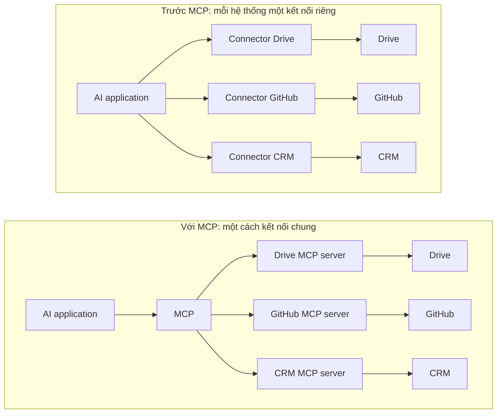
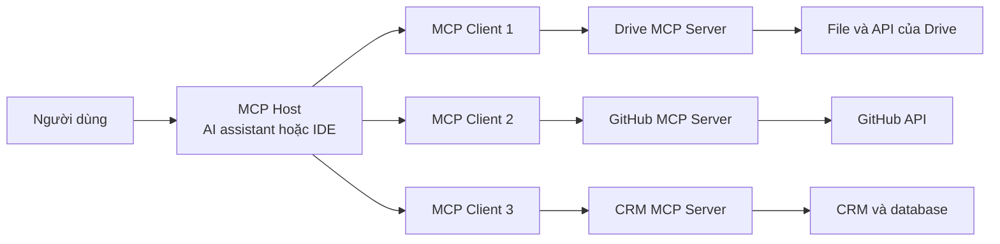
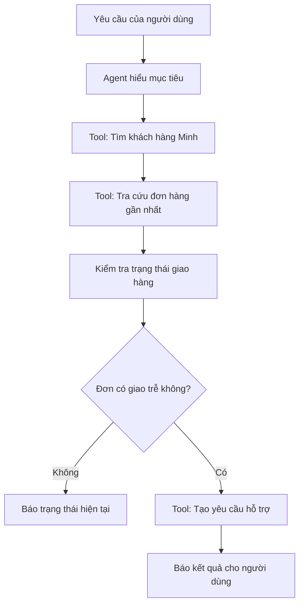
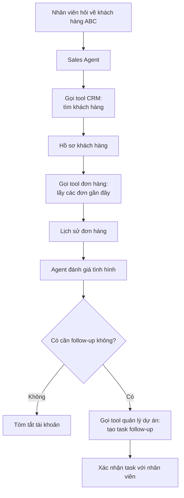
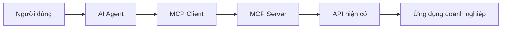
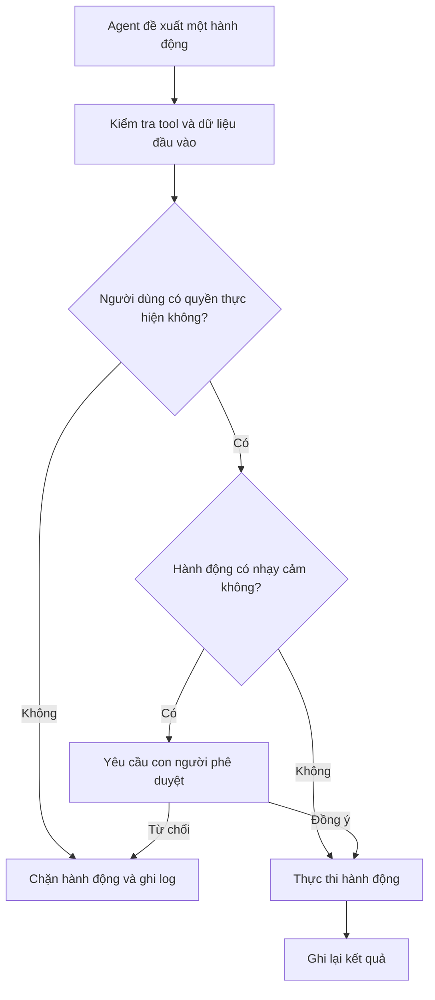
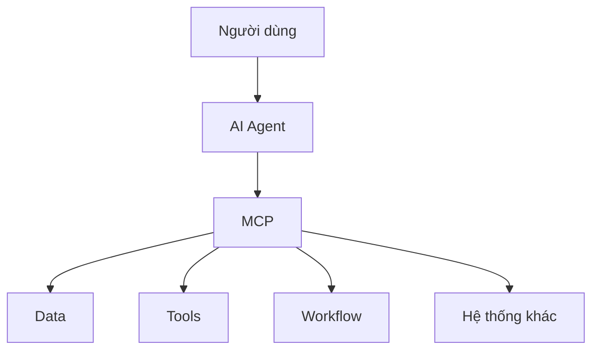
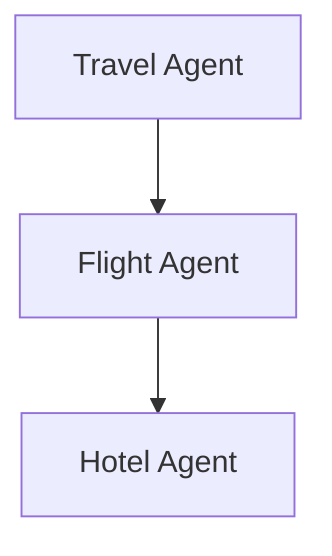

Khi nói về [AI Agent và tool calling](../tool-calling-and-agents/), chúng ta đang nói đến những hệ thống không chỉ trả lời câu hỏi mà còn có thể sử dụng khả năng bên ngoài để hoàn thành một công việc.

Một Agent có thể cần:

- đọc tài liệu;
- tìm kiếm trên web;
- tra cứu khách hàng trong database;
- tạo ticket hỗ trợ;
- đọc lịch;
- chạy code;
- cập nhật một hệ thống nội bộ.

Nghe rất mạnh. Nhưng từ đó xuất hiện một vấn đề thực tế:

> **AI application kết nối với tất cả những hệ thống ấy bằng cách nào?**

Nếu mỗi ứng dụng phải xây một kết nối riêng cho từng hệ thống bên ngoài, chúng ta sẽ nhanh chóng phải duy trì một mạng lưới integration khổng lồ.

Đó là bài toán mà **Model Context Protocol**, hay **MCP**, muốn giải quyết.

## 1. Trước MCP, mỗi kết nối là một dự án riêng

Hãy tưởng tượng bạn đang xây dựng một AI assistant cho công ty. Bạn muốn nó làm việc với Google Drive, Slack, GitHub, database khách hàng và CRM.

Khi chưa có một giao thức chung, ứng dụng có thể cần connector riêng cho từng hệ thống. Nếu muốn đưa cùng những tool đó sang một AI application khác, nhiều phần integration có thể phải được làm lại.



Khi giới thiệu MCP vào tháng 11/2024, Anthropic cũng mô tả đúng vấn đề phân mảnh này: model ngày càng mạnh nhưng mỗi nguồn dữ liệu mới vẫn thường đòi hỏi một integration riêng.

MCP đưa ra một giao thức chung cho lớp kết nối đó.

## 2. Vì sao ví dụ USB-C dễ hiểu?

Có một thời gần như mỗi thiết bị cần một loại dây khác nhau. Điện thoại, máy ảnh, ổ cứng và laptop đều có đầu kết nối riêng.

USB-C không biến những thiết bị ấy thành cùng một thứ. Nó tạo ra **một cách kết nối chung**.

MCP hướng tới vai trò tương tự trong AI. Tài liệu chính thức của MCP cũng dùng chính phép so sánh này:

> **Hãy hình dung MCP như một cổng USB-C dành cho các ứng dụng AI.**

AI application không cần một giao thức trò chuyện hoàn toàn khác nhau cho từng tool hoặc nguồn dữ liệu. MCP định nghĩa một cách chung để khám phá hệ thống bên ngoài cung cấp gì, sau đó trao đổi request và kết quả với hệ thống đó.

Ví dụ này dễ hiểu nhưng không hoàn hảo. Một sợi cáp USB-C thường chỉ cần cắm vào là dùng. Kết nối MCP vẫn liên quan đến permission, authentication, thiết kế tool, phiên bản protocol tương thích và các quyết định bảo mật. Chúng ta sẽ quay lại phần này ở phía sau.

## 3. MCP thực sự là gì?

MCP là viết tắt của **Model Context Protocol**.

Nói đơn giản:

> **MCP là một giao thức mở chuẩn hóa cách AI application kết nối với dữ liệu, tool và workflow bên ngoài.**

Kiến trúc MCP có ba thành phần quan trọng:

- **MCP Host:** ứng dụng AI mà người dùng tương tác, ví dụ một assistant hoặc IDE.
- **MCP Client:** thành phần nằm trong host và duy trì kết nối với một MCP server.
- **MCP Server:** chương trình công bố dữ liệu hoặc khả năng cho host thông qua protocol.

Một host có thể kết nối với nhiều server. Về mặt kỹ thuật, host tạo một MCP client riêng cho mỗi kết nối server.



Server có thể chạy local trên cùng máy hoặc chạy từ xa qua HTTP. Cách truyền dữ liệu có thể khác nhau, nhưng ý tưởng trung tâm không đổi: hai phía cùng nói một protocol chung.

> **MCP chuẩn hóa cuộc trao đổi giữa AI application và MCP server. Nó không quy định model phải reasoning thế nào hoặc hệ thống phía sau phải được xây bằng công nghệ gì.**

## 4. MCP Server có thể cung cấp gì?

Ba khái niệm phía server mà bạn thường gặp nhất là **Tools**, **Resources** và **Prompts**.

### Tools

Có thể hiểu **Tools là những việc mà AI được phép làm thông qua một hệ thống bên ngoài**.

Ví dụ, một AI chăm sóc khách hàng có thể được cung cấp các khả năng như:

- tìm thông tin khách hàng;
- tra cứu đơn hàng;
- tạo yêu cầu hỗ trợ;
- gửi tin nhắn cho nhân viên.

Khi nhận một yêu cầu, Agent sẽ nhìn vào những khả năng mình đang có và chọn công cụ phù hợp.

Ví dụ người dùng nói:

> Kiểm tra giúp tôi đơn hàng gần nhất của khách hàng Minh và tạo yêu cầu hỗ trợ nếu đơn đang giao trễ.

Agent có thể xử lý theo flow:



Với người dùng, đây chỉ giống như giao cho AI một công việc. Còn phía sau, mỗi bước như **tìm khách hàng**, **tra cứu đơn hàng** hay **tạo yêu cầu hỗ trợ** chính là một tool mà hệ thống đã cung cấp cho Agent.

Nói đơn giản:

> **Tool là những khả năng hành động mà AI có thể sử dụng để hoàn thành công việc.**

Model có thể đề xuất một tool call, nhưng application và server xung quanh vẫn kiểm soát lời gọi đó có hợp lệ, được cấp quyền và thật sự được thực thi hay không.

### Resources

Resources là **dữ liệu hoặc nội dung mà application có thể đưa vào context**.

Ví dụ:

- một file;
- tài liệu policy;
- database record;
- API response;
- lịch sử Git.

Nếu tool giống một nút bấm để thực hiện hành động, resource gần với một tài liệu hoặc bản ghi có thể được đọc hơn.

### Prompts

Prompts là những template có thể tái sử dụng cho một kiểu tương tác hoặc workflow cụ thể.

Ví dụ, MCP server có thể cung cấp sẵn template để review một incident, tóm tắt tài khoản khách hàng hoặc tạo release checklist.

Có thể nhớ ba khái niệm như sau:

| Khái niệm | Cách hiểu đơn giản | Ví dụ |
| --- | --- | --- |
| Tool | Việc AI có thể làm | Tạo ticket |
| Resource | Thứ application có thể đọc và đưa vào context | Bản ghi khách hàng |
| Prompt | Cách có sẵn để hướng dẫn một workflow | Template review incident |

Bạn không cần ghi nhớ toàn bộ thuật ngữ của protocol. Ý chính chỉ là:

> **MCP server nói với AI application: "Đây là những thứ tôi cung cấp, và đây là cách chuẩn để sử dụng chúng."**

## 5. Một ví dụ thực tế: AI hỗ trợ sales

Giả sử một nhân viên sales hỏi AI assistant:

> Khách hàng ABC gần đây thế nào? Nếu có vấn đề thì tạo giúp tôi một task follow-up.

Agent có thể cần thông tin khách hàng từ CRM, lịch sử đơn hàng từ database và một công cụ quản lý dự án để tạo task.



Model không cần biết CRM dùng database engine nào hoặc API quản lý dự án được viết bằng ngôn ngữ gì. Nó cần mô tả rõ về các khả năng, input của chúng và kết quả chúng trả về.

Đó là giá trị của một giao diện chung.

## 6. MCP có thay thế API không?

Không, nhưng có một điểm cần nói chính xác hơn.

Một hệ thống doanh nghiệp có thể đã cung cấp các endpoint như:

```text
GET  /customers
GET  /orders
POST /tickets
```

Những API đó không biến mất. MCP server có thể gọi chúng và công bố một số khả năng đã chọn cho AI application thông qua MCP.



Tuy nhiên, MCP server không bắt buộc phải bọc một HTTP API. Nó cũng có thể làm việc với file local, database driver, chương trình command-line hoặc một service khác.

Cách phân biệt gọn nhất là:

- **API** định nghĩa cách phần mềm tương tác với một service cụ thể.
- **MCP** định nghĩa cách AI application khám phá và sử dụng context cùng các khả năng do MCP server công bố.

Ví dụ, Agents API của OpenAI có thể khám phá tool definition từ MCP server, yêu cầu server chạy tool rồi trả kết quả về cho Agent. Application không cần tự xử lý riêng từng loại tool call.

Vì vậy, gọi MCP là "một dạng API mới" vẫn chưa đầy đủ. Nó gần với một lớp kết nối chuẩn có thể nằm trên API và các hệ thống sẵn có khác hơn.

## 7. Vì sao MCP đáng chú ý?

Điểm đáng giá của MCP nằm ở **khả năng tái sử dụng kết nối**.

Hãy tưởng tượng một công ty đã cung cấp qua một MCP Server các khả năng như:

- Tìm kiếm tài liệu
- Tra cứu doanh số
- Kiểm tra tồn kho
- Tạo yêu cầu hỗ trợ

Mỗi khả năng ở đây có thể được đóng gói thành một **tool** để AI Agent sử dụng khi cần.

Về lý tưởng, nhiều AI application hoặc Agent có hỗ trợ MCP có thể cùng kết nối tới MCP Server đó, thay vì công ty phải xây lại một integration riêng cho từng model hay từng trợ lý AI.

Có thể hiểu đơn giản:

> **Một lần chuẩn hóa cách kết nối, nhiều hệ thống AI có thể cùng sử dụng lại.**

Điều này quan trọng vì Agent không chỉ cần biết mình có những tool nào, mà còn phải hiểu:

- tool đó dùng để làm gì;
- cần cung cấp thông tin gì khi gọi;
- kết quả trả về có dạng như thế nào.

MCP giúp chuẩn hóa phần giao tiếp đó giữa **AI application** và các **tool hoặc data source** bên ngoài.

Nó không đảm bảo mọi MCP Server sẽ hoạt động hoàn hảo với mọi hệ thống AI, nhưng tạo ra một **contract chung** để các bên cùng dựa vào.

Và đó là lý do MCP đáng chú ý:

**nó không thay thế tool hay API hiện có, mà giúp AI kết nối và sử dụng chúng theo một cách thống nhất hơn.**

## 8. MCP không còn chỉ là công nghệ của Claude

Anthropic giới thiệu và open-source MCP ngày 25/11/2024.

Ngày 9/12/2025, MCP trở thành một dự án sáng lập của **Agentic AI Foundation**, hay AAIF, thuộc Linux Foundation. Foundation ra mắt với các dự án đóng góp từ Anthropic, Block và OpenAI, tạo một nơi trung lập với nhà cung cấp cho hạ tầng Agent mã nguồn mở.

Hiện MCP đã được hỗ trợ trên nhiều AI application và công cụ phát triển. OpenAI cũng hỗ trợ kết nối MCP trong nền tảng Agent và cung cấp một MCP server công khai cho tài liệu developer của mình.

Sự hỗ trợ rộng này rất quan trọng. Một chuẩn kết nối trở nên hữu ích hơn nhiều khi các ứng dụng và hệ thống độc lập đều có thể nói cùng một giao thức.

Một loại dây chỉ dùng cho duy nhất một chiếc điện thoại sẽ không thể trở thành USB-C.

## 9. Có cổng kết nối chung không có nghĩa kết nối nào cũng an toàn

Phép so sánh MCP với USB-C rất dễ hiểu, nhưng cũng có một điểm cần lưu ý:

> **Kết nối được không có nghĩa là được phép làm mọi thứ.**

Một tool chỉ dùng để **tìm kiếm tài liệu** thường có mức rủi ro khá thấp.

Nhưng nếu Agent được cung cấp những khả năng như:

- Xóa thông tin khách hàng
- Chuyển tiền
- Deploy hệ thống lên production

thì câu chuyện hoàn toàn khác.

MCP giúp chuẩn hóa cách một tool được **công bố, mô tả và gọi**. Nhưng MCP không tự quyết định người dùng nào được phép sử dụng tool đó, Agent được phép làm tới đâu, hay hành động nào cần con người phê duyệt.

Một hệ thống thực tế có thể vận hành như sau:



Vì vậy, bên cạnh MCP vẫn cần những lớp bảo vệ như **authentication** (xác minh ai đang truy cập), **authorization** (người đó được phép làm gì), giới hạn quyền theo nguyên tắc **least privilege**, cùng với approval và audit log cho những hành động quan trọng.

Có thể hình dung đơn giản:

> **MCP giúp AI biết có những cánh cửa nào và cách mở chúng.**

Nhưng hệ thống bảo mật vẫn phải quyết định:

> **AI đang cầm chìa khóa nào, được phép mở cửa nào - và cửa nào phải có con người đồng ý trước khi mở.**

## 10. "USB-C cho AI" dễ hiểu nhưng chưa đầy đủ

Phép so sánh MCP với USB-C giúp chúng ta nhanh chóng hiểu ý tưởng về một chuẩn kết nối chung. Nhưng nếu hiểu quá sát, nó cũng dễ làm MCP trông đơn giản hơn thực tế.

MCP không làm biến mất những bài toán như:

- access permission;
- authentication;
- thiết kế tool an toàn;
- khả năng tương thích giữa các phiên bản protocol;
- quản lý context;
- hay cách Agent lựa chọn đúng tool.

Nói cách khác, MCP giúp các bên **không phải tự nghĩ ra một cách kết nối mới cho từng cặp AI-tool**.

Nhưng một giao thức chung mới chỉ là **nền móng**. Để xây một hệ thống AI chạy được trong thực tế, chúng ta vẫn cần model, Agent, tools, quyền truy cập, guardrails và nhiều lớp kiểm soát khác.

Và khi đặt MCP vào giữa những mảnh ghép đó, bức tranh lớn hơn bắt đầu hiện ra.

## Từ chatbot đến một hệ sinh thái AI

Nếu nhìn lại những phần trước, chúng ta có thể thấy AI đang dần đi xa hơn mô hình "người hỏi - máy trả lời".

- Model có thể reasoning và tạo nội dung.
- [Model System-1-like](../system-1-vs-system-2-in-ai-vi/) có thể xử lý những quyết định nhanh và có phạm vi hẹp.
- Agent có thể tự chọn bước tiếp theo và sử dụng tool.
- MCP tạo ra một cách chung để AI application kết nối với tools, dữ liệu và các hệ thống bên ngoài.

Có thể hình dung:



AI lúc này không còn chỉ tồn tại trong một cửa sổ chat.

Nó bắt đầu đọc dữ liệu, sử dụng phần mềm và tương tác với những hệ thống mà con người đang dùng hàng ngày.

Nhưng khi một Agent đã có thể dùng tools, một câu hỏi khác sẽ xuất hiện:

> **Nếu Agent đó cần nhờ một Agent khác làm một phần công việc thì sao?**

Ví dụ:



Ở đây, vấn đề không còn chỉ là **Agent kết nối với tool** nữa.

Nó trở thành bài toán **Agent giao tiếp và phối hợp với Agent khác**.

Và đó chính là nơi A2A xuất hiện.

**Chủ đề tiếp theo: MCP vs A2A - khi AI không chỉ dùng công cụ mà còn phải nói chuyện với AI khác.**

## Nguồn tham khảo

- [Model Context Protocol - MCP là gì?](https://modelcontextprotocol.io/docs/getting-started/intro)
- [Model Context Protocol - Tổng quan kiến trúc](https://modelcontextprotocol.io/docs/learn/architecture)
- [Model Context Protocol - Specification 2026-07-28](https://modelcontextprotocol.io/specification/2026-07-28)
- [Anthropic - Introducing the Model Context Protocol](https://www.anthropic.com/news/model-context-protocol)
- [Linux Foundation - Thành lập Agentic AI Foundation](https://www.linuxfoundation.org/press/linux-foundation-announces-the-formation-of-the-agentic-ai-foundation)
- [OpenAI - Kết nối MCP trong Agents API](https://developers.openai.com/api/docs/guides/agents-api/tools/mcp)
