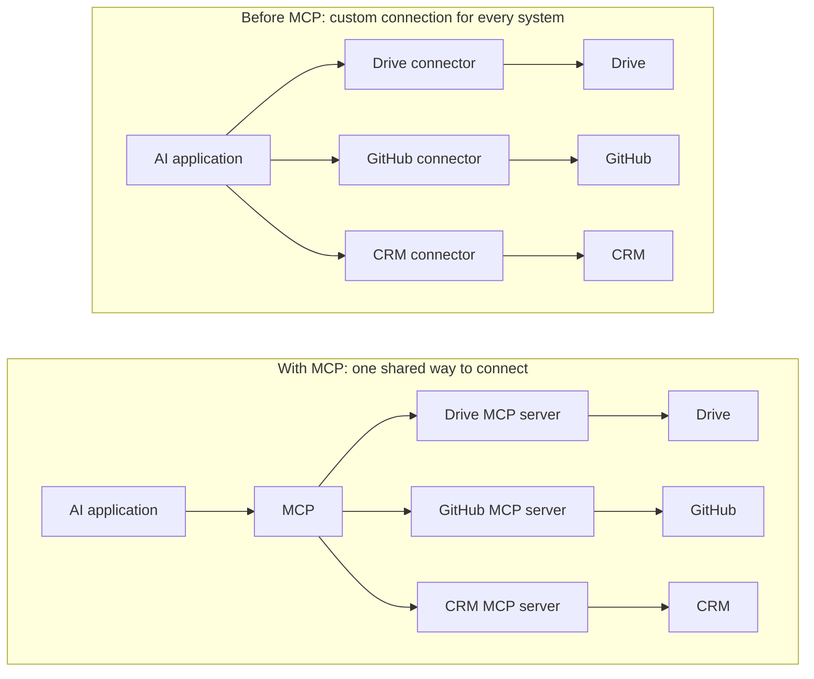
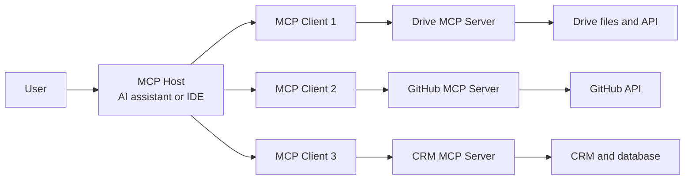
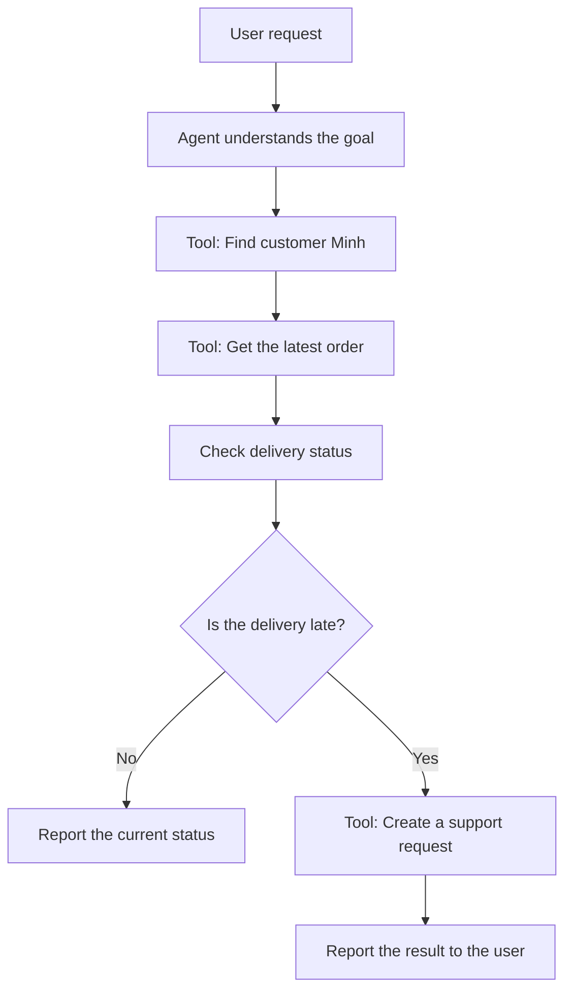
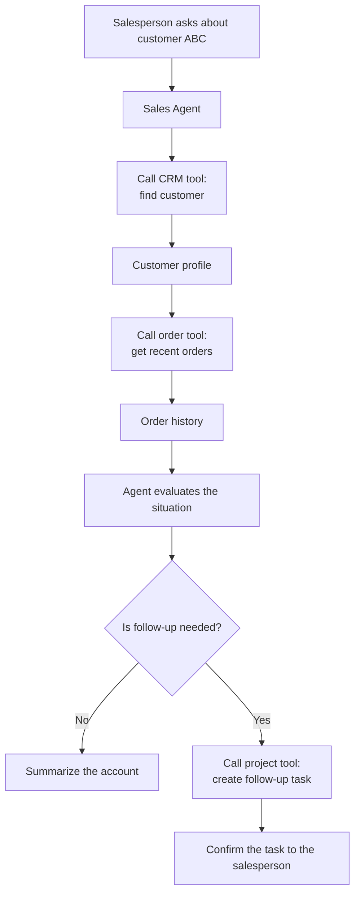
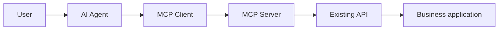
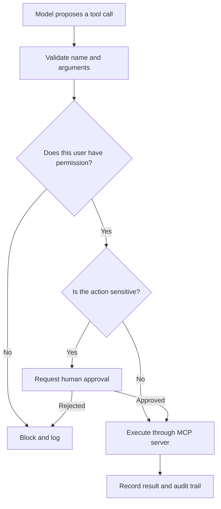
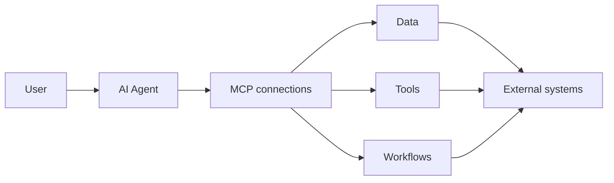
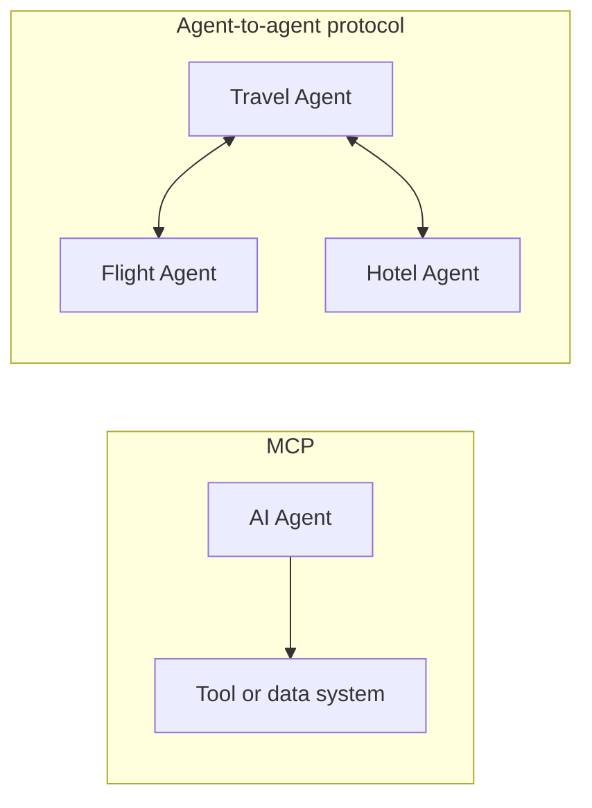

When we talk about an [AI agent and tool calling](../tool-calling-and-agents/), we mean a system that can do more than answer a question. It can use external capabilities to complete a task.

An agent might need to:

- read a document;
- search the web;
- look up a customer in a database;
- create a support ticket;
- check a calendar;
- run code;
- update an internal system.

That sounds powerful. But it creates a practical problem:

> **How does an AI application connect to all of those systems?**

If every application needs a different custom connection for every external system, we quickly end up maintaining a large web of integrations.

That is the problem the **Model Context Protocol**, or **MCP**, is designed to address.

## 1. Before MCP, every connection was its own project

Imagine that you are building an AI assistant for a company. You want it to work with Google Drive, Slack, GitHub, a customer database, and a CRM.

Without a shared protocol, the application may need a separate connector for each system. Move the same tools to another AI application and much of that integration work may need to be repeated.



When Anthropic introduced MCP in November 2024, it described the same fragmentation problem: models were becoming more capable, but every new data source still required its own custom implementation.

MCP offers a common protocol for that connection layer.

## 2. Why the USB-C analogy works

There was a time when almost every device seemed to require a different cable. Phones, cameras, hard drives, and laptops all had their own connectors.

USB-C did not turn those devices into the same thing. It gave them a **shared way to connect**.

MCP aims for a similar role in AI. In fact, the official MCP documentation uses this exact analogy:

> **Think of MCP as a USB-C port for AI applications.**

An AI application does not need a completely different conversation protocol for every tool or data source. MCP defines a common way to discover what an external system offers and to exchange requests and results with it.

The analogy is helpful, but not perfect. A physical USB-C cable is usually plug-and-play. An MCP connection still involves permissions, authentication, tool design, compatible protocol versions, and security decisions. We will return to that later.

## 3. What MCP actually is

MCP stands for **Model Context Protocol**.

In plain language:

> **MCP is an open protocol that standardizes how an AI application connects to external data, tools, and workflows.**

Its architecture has three important participants:

- **MCP Host:** the AI application the user interacts with, such as an assistant or IDE.
- **MCP Client:** a component inside the host that maintains a connection to one MCP server.
- **MCP Server:** a program that exposes data or capabilities to the host through the protocol.

One host can connect to several servers. Technically, it creates a separate MCP client for each server connection.



The server may run locally on the same computer or remotely over HTTP. The technical transport differs, but the central idea stays the same: the two sides speak a shared protocol.

> **MCP standardizes the conversation between the AI application and the MCP server. It does not dictate how the model must reason or how the external system must be implemented.**

## 4. What can an MCP server provide?

The three server primitives you will encounter most often are **Tools**, **Resources**, and **Prompts**.

### Tools

The easiest non-technical definition is:

> **Tools are things an AI is allowed to do through an external system.**

A customer support AI might be given capabilities such as:

- find customer information;
- look up an order;
- create a support request;
- send a message to an employee.

When a user makes a request, the agent can inspect its available capabilities and select the appropriate tools.

For example:

> Check Minh's latest order and create a support request if the delivery is late.

The agent's workflow might look like this:



To the user, this feels like assigning the AI one job. Behind the scenes, actions such as **find customer**, **look up order**, and **create support request** are separate tools provided to the agent.

In other words:

> **A tool is an action capability the AI can use to complete a task.**

The model can propose a tool call, but the surrounding application and server still control whether that call is valid, authorized, and actually executed.

### Resources

Resources are **data or content that an application can make available as context**.

Examples include:

- a file;
- a policy document;
- a database record;
- an API response;
- Git history.

If a tool is similar to a button that performs an action, a resource is closer to a document or record that can be read.

### Prompts

Prompts are reusable templates for a particular interaction or workflow.

For example, an MCP server might provide a prepared template for reviewing an incident, summarizing a customer account, or generating a release checklist.

The three concepts can be remembered like this:

| Primitive | Plain-language meaning | Example |
| --- | --- | --- |
| Tool | Something the AI can do | Create a ticket |
| Resource | Something the application can read and provide as context | A customer record |
| Prompt | A reusable way to guide a workflow | Incident review template |

You do not need to memorize the protocol vocabulary. The main idea is simply:

> **An MCP server tells the AI application: "Here is what I offer, and here is the standard way to use it."**

## 5. A practical example: a sales assistant

Suppose a salesperson asks an AI assistant:

> How has customer ABC been doing recently? If there is a problem, create a follow-up task for me.

The agent may need information from a CRM, order history from a database, and a project management tool for creating the task.



The model does not need to know which database engine the CRM uses or which programming language implements the project management API. It needs a clear description of the capabilities, their inputs, and the results they return.

That is the value of a shared interface.

## 6. Does MCP replace APIs?

No, but there is an important nuance.

An existing business system may already expose endpoints such as:

```text
GET  /customers
GET  /orders
POST /tickets
```

Those APIs do not disappear. An MCP server can call them and expose selected capabilities to an AI application through MCP.



However, an MCP server does not have to wrap an HTTP API. It can also work with local files, a database driver, a command-line program, or another service.

The clean distinction is:

- **An API** defines how software interacts with a particular service.
- **MCP** defines how AI applications discover and use context and capabilities exposed by MCP servers.

OpenAI's Agents API, for example, can discover tool definitions from an MCP server, ask that server to run a tool, and return the result to an agent. The application does not need custom handling for each individual tool call.

Calling MCP "a new kind of API" is therefore incomplete. It is closer to a standard connection layer that can sit on top of APIs and other existing systems.

## 7. Why MCP matters

The important benefit is not the novelty of a few protocol messages. It is **reuse**.

Imagine that a company exposes these capabilities through one MCP server:

```text
search_documents
query_sales
get_inventory
create_ticket
```

In principle, multiple MCP-compatible AI applications can connect to that server without the company rebuilding the same integration specifically for every model or assistant.

This matters for agents because an agent needs tools, and tools need a consistent way to be:

- discovered;
- described;
- invoked;
- monitored;
- updated.

MCP standardizes much of that boundary. It does not guarantee that every server works perfectly with every host, but it gives the ecosystem a common contract to build around.

## 8. MCP is no longer only a Claude technology

Anthropic introduced and open-sourced MCP on November 25, 2024.

On December 9, 2025, MCP became a founding project of the **Agentic AI Foundation**, or AAIF, under the Linux Foundation. The foundation launched with project contributions from Anthropic, Block, and OpenAI, providing a vendor-neutral home for open agent infrastructure.

MCP is now supported across a broad set of AI applications and development tools. OpenAI also supports MCP connections in its agent platform and provides a public MCP server for its developer documentation.

This broad support matters. A connection standard becomes far more useful when many independent applications and systems can speak it.

One cable used by only one phone would never become USB-C.

## 9. A shared connector does not make every connection safe

This is the part the USB-C analogy can hide.

A read-only search tool has limited consequences. Tools such as these are different:

```text
delete_customer
transfer_money
deploy_production
```

MCP standardizes how a capability is exposed and called. It does not decide your business policy for whether a particular user or model should be allowed to perform an action.

A safer system places controls around the tool call:



Authentication, authorization, least-privilege scopes, approval, logging, and security policy still need careful design. The MCP specification includes authorization support for HTTP transports, and the 2026-07-28 revision strengthened its authorization model. Even so, the specification explicitly places many consent, access-control, and tool-safety responsibilities on implementers.

The short version is:

> **MCP helps an AI application find the door.**

But these remain separate questions:

> **Which key does it have, which door may it open, and who must approve the action?**

## 10. "USB-C for AI" is useful, but incomplete

The analogy explains interoperability well. It should not be taken literally.

MCP does not remove the need to think about:

- access permissions;
- authentication;
- safe tool design;
- protocol compatibility;
- malicious or misleading content;
- context management;
- how an agent chooses the right tool.

MCP helps us avoid reinventing the connection contract for every AI-tool pair. That alone is valuable, but a shared protocol is a foundation, not a finished production system.

## From chatbots to an AI ecosystem

The pieces now form a larger picture:

- A model can reason and generate content.
- A [System-1-like model](../system-1-vs-system-2-in-ai/) can make fast, narrow decisions.
- An agent can choose actions and use tools.
- MCP gives AI applications a shared way to connect to those tools and their context.



AI is no longer confined to a chat window. It is beginning to connect with the data and software people use every day.

MCP mainly addresses the relationship between an AI application and external capabilities. A natural next question is what happens when one agent needs to communicate with another agent.



That leads to the next topic: **MCP vs. A2A - when AI must not only use tools, but also communicate with other AI agents.**

## References

- [Model Context Protocol - What is MCP?](https://modelcontextprotocol.io/docs/getting-started/intro)
- [Model Context Protocol - Architecture overview](https://modelcontextprotocol.io/docs/learn/architecture)
- [Model Context Protocol - Specification 2026-07-28](https://modelcontextprotocol.io/specification/2026-07-28)
- [Anthropic - Introducing the Model Context Protocol](https://www.anthropic.com/news/model-context-protocol)
- [Linux Foundation - Formation of the Agentic AI Foundation](https://www.linuxfoundation.org/press/linux-foundation-announces-the-formation-of-the-agentic-ai-foundation)
- [OpenAI - MCP connections in the Agents API](https://developers.openai.com/api/docs/guides/agents-api/tools/mcp)
