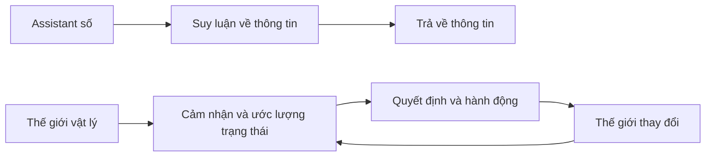
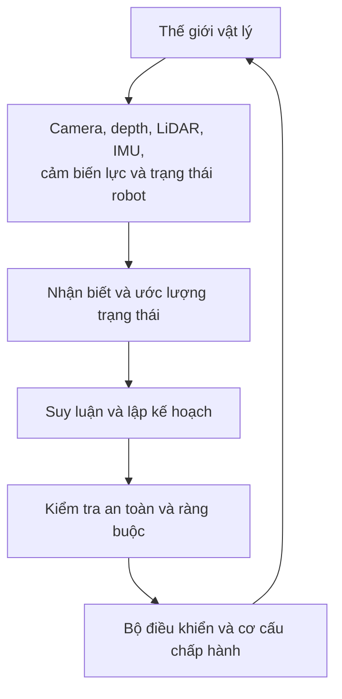
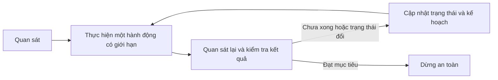
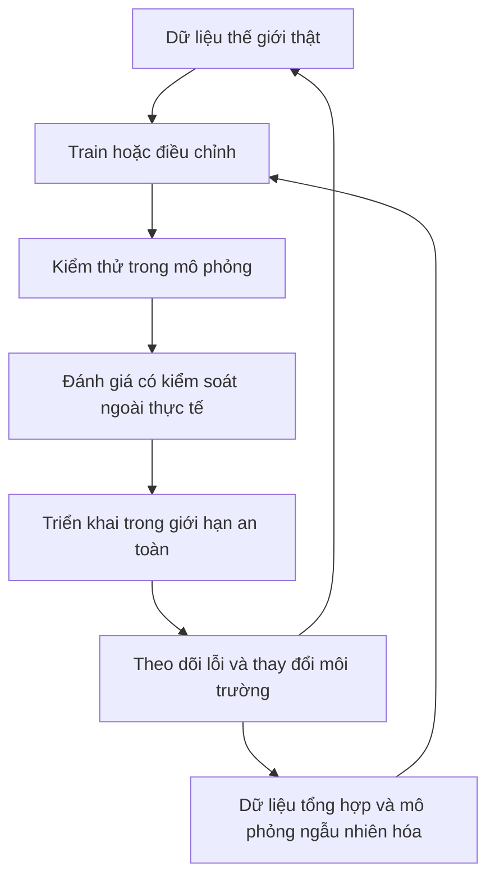

Chatbot có thể suy luận rất giỏi trong thế giới số. Nhưng robot, xe tự hành hay hệ thống tự động trong nhà máy phải giải thêm một bài toán: nhìn thế giới thật, làm điều gì đó trong thế giới ấy, rồi xử lý hệ quả từ chính hành động của mình.

Hãy tưởng tượng một chiếc hộp chắn lối đi. Một assistant có thể trả lời: "Hãy chuyển hộp sang bên phải." Còn robot phải tìm hộp, ước lượng vị trí, chọn chỗ đặt an toàn, tránh người đi lại, cầm hộp, di chuyển và kiểm tra xem lối đi đã thông chưa. Câu trả lời mới chỉ là điểm bắt đầu, không phải lúc công việc hoàn tất.

Đó là vùng mà khái niệm **Physical AI** bắt đầu có ý nghĩa.

## 1. Physical AI là gì?

Physical AI là một thuật ngữ bao trùm đang phát triển, không phải một bản đặc tả kỹ thuật có duy nhất một định nghĩa. [NVIDIA dùng thuật ngữ này](https://www.nvidia.com/en-gb/glossary/generative-physical-ai/) cho những hệ thống tự động như robot, xe tự hành và không gian thông minh có thể cảm nhận, suy luận rồi hành động trong thế giới vật lý. Hành động có thể là di chuyển tay robot, phanh xe, đổi đường bay của drone hoặc điều phối thiết bị trong tòa nhà.

Khác biệt quan trọng nằm ở **phản hồi**: hành động làm thế giới thay đổi, và lần quan sát tiếp theo phải ghi nhận sự thay đổi đó.

Coding Agent cũng có thể sửa một file thật, nên "thế giới số" không có nghĩa là "không có hậu quả". Điểm phân biệt ở đây là môi trường vận hành: hành động vật lý chịu tác động của chuyển động, lực, thời gian, cảm biến không hoàn hảo và ràng buộc an toàn.

[Bài trước về VLM và VLA](../vlm-vs-vla-from-seeing-to-acting-vi/) tập trung vào output của model: mô tả hay biểu diễn hành động. Bài này lùi ra một bước để nhìn **toàn bộ hệ thống** cần có nhằm biến hành động đó thành kết quả đáng tin cậy.

## 2. Robot không nhận một bản mô tả sạch sẽ về thực tại

Chatbot có thể nhận một prompt bằng chữ khá rõ ràng. Robot thì nhận các phép đo: ảnh camera, bản đồ độ sâu, tín hiệu LiDAR, vị trí khớp, cảm biến lực hoặc IMU. Xe tự hành còn có thể dùng radar và tín hiệu định vị. Không hệ thống nào bắt buộc phải dùng toàn bộ các loại cảm biến này.

Mỗi loại trả lời một câu hỏi khác nhau. Ảnh RGB cho biết hình dạng và màu sắc; depth và LiDAR giúp ước lượng khoảng cách, hình học; **proprioception** cho robot biết khớp và gripper của chính nó đang ở đâu. Nhưng phép đo luôn có giới hạn. Vật này che vật kia. Ánh sáng phản chiếu. Camera có thể mờ, bánh xe có thể trượt, cảm biến có thể bị lệch.

Vì vậy, hệ thống cần ước lượng một **trạng thái hiện tại đủ hữu ích**, chứ không coi một cảm biến là toàn bộ sự thật. Kết hợp cảm biến có thể giúp ích, nhưng không xóa sạch bất định.

Đây là một cách hình dung, không phải kiến trúc bắt buộc. Một model có thể gộp nhiều ô; hệ thống khác lại tách chúng thành các thành phần chuyên biệt. Điều cốt lõi là **vòng lặp**, không phải ranh giới chính xác giữa các ô.

## 3. Biết có gì trong cảnh vẫn chưa đủ

Giả sử robot thấy cốc, bàn và khay. Người dùng nói: "Đặt chiếc cốc vào khay." Nhận ra các vật thể vẫn chưa cho biết nên tiếp cận từ trái hay phải, xoay gripper ra sao, có cần dời vật cản hay chọn đường khác không.

Để chọn giữa nhiều hành động, hệ thống phải xét các hệ quả có thể xảy ra:

| Hành động dự định | Hệ quả cần kiểm tra |
| --- | --- |
| Đưa tay từ bên trái | Cánh tay có va vào kệ không? |
| Cầm cốc từ trên xuống | Gripper có đủ khoảng trống không? |
| Dời chiếc hộp bên cạnh trước | Hộp có thể làm đổ cốc không? |

Đây là nơi [world model](../what-are-world-models-vi/) có thể hữu ích: biểu diễn trạng thái hiện tại và dự đoán nó sẽ đổi thế nào sau một hành động. Điều đó **không nhất thiết** là tạo một video tương lai đẹp như thật. Dự đoán hữu ích đôi khi chỉ cần cho biết "đường này dễ va chạm" hoặc "dời vật cản thì có thể chạm tới mục tiêu".

Lập kế hoạch và thực thi cũng có thể tách tầng. [Google DeepMind mô tả Gemini Robotics ER 2](https://deepmind.google/models/gemini-robotics/embodied-reasoning/) đảm nhận suy luận về thế giới vật lý và kế hoạch nhiều bước ở tầng cao, rồi chuyển phần thực thi chuyển động cho một model VLA ở tầng dưới. Đây là một ví dụ, không phải khuôn mẫu bắt buộc cho mọi hệ thống.

## 4. Hành động phải nằm trong vòng lặp phản hồi

Robot quyết định cầm cốc và bắt đầu đưa tay tới. Nhưng chiếc cốc trượt đi 2 cm. Nếu robot cứ thực hiện trọn một quỹ đạo được tính từ ảnh đầu tiên, các bước sau sẽ dựa trên trạng thái đã lỗi thời.

Đó là **closed-loop control**: quan sát, hành động, đo kết quả, rồi điều chỉnh. Cụm "có giới hạn" rất quan trọng. Khi vận hành thực tế, hệ thống có thể giới hạn quãng đường hoặc tốc độ trước mỗi lần kiểm tra lại. Nếu cầm hụt, việc **nhận ra cầm hụt** quan trọng không kém việc đề xuất động tác cầm ban đầu.

## 5. Độ trễ cũng là một phần của kiến trúc

Thời gian phản hồi phù hợp tùy vào công việc. Một robot kho hàng đang lên kế hoạch tuyến đường tiếp theo có thể chấp nhận dịch vụ lập kế hoạch từ xa chậm hơn. Giữ thăng bằng, tránh vật cản hay dừng khẩn cấp có thể cần vòng điều khiển cục bộ nhanh hơn nhiều. Không có một ngưỡng mili-giây chung bảo đảm an toàn cho mọi bài toán vật lý.

Nếu mọi quyết định đều phải đi từ robot lên cloud rồi quay lại, hệ thống sẽ phụ thuộc vào độ trễ mạng, kết nối và tính sẵn sàng của dịch vụ. Vì vậy, người ta thường tách **lập kế hoạch cấp cao** khỏi **điều khiển nhạy với thời gian**, đặt phần sau gần thiết bị hơn. Điều này lại kéo theo giới hạn về compute, bộ nhớ, điện năng và nhiệt. [Tổng quan Physical AI của NVIDIA](https://www.nvidia.com/en-gb/glossary/generative-physical-ai/) cũng đặt training, simulation và runtime compute trong cùng một stack.

Câu hỏi không chỉ là "Model mạnh đến đâu?", mà còn là **"Mỗi quyết định nên chạy ở đâu và cần có hiệu lực nhanh thế nào?"**

## 6. Vì sao cần mô phỏng, và vì sao mô phỏng chưa đủ

Dạy robot bằng cách cho hộp thật rơi, hay tạo tình huống xe thật suýt va chạm hàng nghìn lần, sẽ tốn kém và nguy hiểm. Mô phỏng cho phép thử nhiều vị trí vật thể, điều kiện ánh sáng, bề mặt hay lỗi cảm biến mà không liên tục đặt phần cứng và con người vào rủi ro.

[NVIDIA Isaac Sim](https://developer.nvidia.com/isaac/sim/) là một môi trường mô phỏng robot dùng để kiểm thử và tạo dữ liệu tổng hợp. Nhưng robot chạy tốt trong mô phỏng vẫn có thể thất bại ở kho hàng: ma sát thực khác đi, cảm biến nhiễu, hộp bị móp và con người di chuyển khó đoán. Khoảng cách ấy gọi là **sim-to-real gap**.

Một cách ứng phó là **domain randomization**: thay đổi nhiều đặc tính của môi trường mô phỏng để hệ thống không phụ thuộc vào một thế giới sạch sẽ duy nhất. [Nghiên cứu ban đầu về domain randomization](https://arxiv.org/abs/1703.06907) đã khảo sát hướng chuyển kết quả học từ mô phỏng sang thế giới thật. Cách này có thể hữu ích, nhưng không thay được việc kiểm thử trên phần cứng thật trong môi trường dự định triển khai.

Câu hỏi hữu ích không phải "Nó đã chạy được trong simulator chưa?", mà là **"Ta đã thật sự kiểm tra những điều kiện thực tế nào, và chuyện gì xảy ra ngoài các điều kiện đó?"**

## 7. Physical AI rộng hơn robot hình người

Drone đổi hướng khi gặp vật cản, xe phản ứng với giao thông, hay kho hàng điều phối nhiều thiết bị tự động đều có thể nằm trong cuộc thảo luận này. Chúng không có chung hình dạng, cảm biến, không gian hành động hay yêu cầu an toàn.

Physical AI và Agentic AI cũng mô tả hai trục khác nhau:

| Thuật ngữ | Câu hỏi chính |
| --- | --- |
| Agentic AI | Ai chọn bước tiếp theo và điều phối chuỗi hành động? |
| Physical AI | Hệ thống có cảm nhận và tác động lên thế giới vật lý không? |

Coding Agent có tính agentic nhưng chủ yếu làm việc trong phần mềm. Robot lặp lại một chính sách điều khiển cố định có thể tác động vật lý nhưng ít tự chủ ở cấp cao. Một robot tự chủ có thể là cả hai.

## 8. Model mạnh không tự biến thành hệ thống an toàn

Hành động vật lý có thể gây hại cho người và thiết bị. Một kế hoạch nghe hợp lý do foundation model đưa ra **không tự bảo đảm** chuyển động an toàn. Tùy ứng dụng, hệ thống xung quanh còn cần kiểm tra va chạm, giới hạn tốc độ hoặc lực, vùng hoạt động cho phép, phê duyệt của con người, controller tầng thấp, dừng khẩn cấp và nhật ký vận hành. Yêu cầu an toàn thay đổi theo thiết bị và môi trường.

Physical AI cũng không mặc nhiên tốt hơn tự động hóa truyền thống. Nếu robot lặp đi lặp lại một thao tác cố định trong môi trường được kiểm soát, controller xác định có thể đơn giản, nhanh và dễ kiểm chứng hơn. AI có giá trị hơn khi vật thể, layout, instruction hoặc điều kiện thay đổi đến mức khó viết sẵn mọi quy tắc. Hai cách tiếp cận hoàn toàn có thể cùng tồn tại.

## Bài kiểm tra thật nằm sau hành động đầu tiên

LLM có thể biết rằng nên đưa chiếc cốc ra xa mép bàn. VLM có thể xác định chiếc cốc. VLA có thể tạo action cho robot. Nhưng một hệ thống Physical AI hoàn chỉnh còn phải xác nhận action khả thi, thực thi trong giới hạn an toàn, phát hiện nếu cầm hụt, phục hồi khi có thể và kiểm tra chiếc cốc đã thật sự an toàn chưa.

Đó là bước chuyển từ **mô tả thế giới** sang **tham gia vào thế giới**. Trí tuệ vật lý không nằm riêng trong một model, mà trong cả vòng lặp: cảm nhận, ước lượng trạng thái, dự đoán, lập kế hoạch, điều khiển và phản hồi.

## Nguồn tham khảo

- [What is Physical AI? - NVIDIA](https://www.nvidia.com/en-gb/glossary/generative-physical-ai/)
- [Gemini Robotics ER 2 - Google DeepMind](https://deepmind.google/models/gemini-robotics/embodied-reasoning/)
- [NVIDIA Isaac Sim - NVIDIA Developer](https://developer.nvidia.com/isaac/sim/)
- [Domain Randomization for Transferring Deep Neural Networks from Simulation to the Real World - arXiv](https://arxiv.org/abs/1703.06907)
