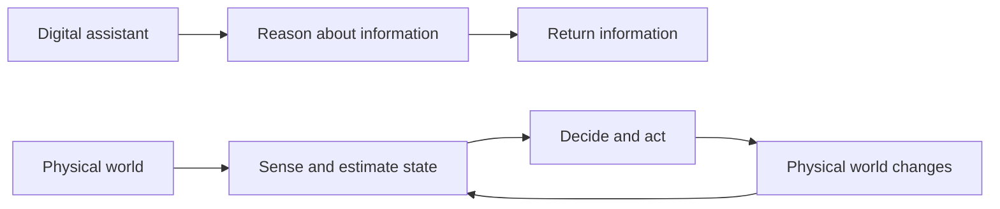
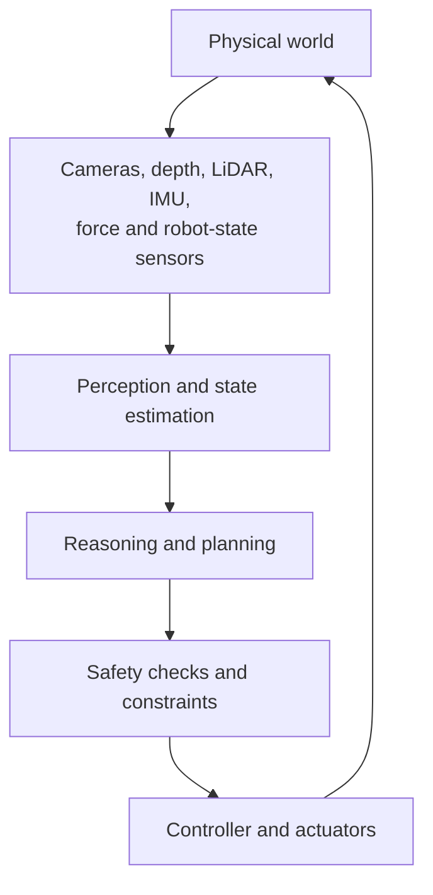
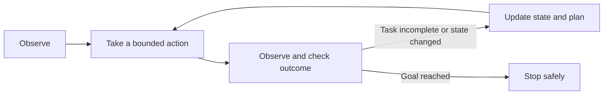
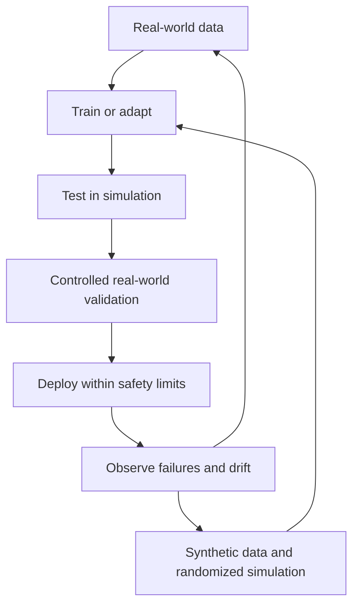

A chatbot can reason brilliantly in a digital environment. A robot, autonomous vehicle, or factory system faces an extra challenge: it must observe the physical world, do something in it, and live with the consequences.

Imagine a box blocking a corridor. An assistant might say, "Move the box to the right." A robot must find the box, estimate its position, choose a safe destination, navigate around people, grasp it, move it, and confirm the corridor is clear. The instruction is the beginning of the job, not its completion.

That is the territory of **Physical AI**.

## 1. What does "Physical AI" mean?

Physical AI is an evolving umbrella term, not a single technical specification. [NVIDIA uses it](https://www.nvidia.com/en-gb/glossary/generative-physical-ai/) for autonomous systems, including robots, vehicles, and smart spaces, that perceive, reason about, and act in the physical world. The system might move a robot arm, brake a vehicle, change a drone's route, or coordinate equipment in a building.

The important distinction is **feedback**: an action changes the world, and the next observation must reflect that change.

A coding agent can also change a real file, so "digital" does not mean "no consequences." The distinction here is the operating environment: physical actions face motion, force, timing, imperfect sensors, and safety constraints.

The [previous article on VLMs and VLAs](../vlm-vs-vla-from-seeing-to-acting/) focused on what a model produces: a description or an action representation. Physical AI zooms out to the **whole system** needed to make that action work reliably.

## 2. A robot does not receive a neat description of reality

A chatbot can receive a well-formed text prompt. A robot receives measurements: camera images, depth maps, LiDAR returns, joint positions, force readings, or IMU measurements. A vehicle may also use radar and location signals. No system needs every sensor on this list.

Each sensor answers a different question. RGB images reveal appearance; depth and LiDAR help estimate geometry and distance; proprioception tells a robot where its own joints and gripper are. But measurements are incomplete. Objects occlude one another. Light reflects. A camera can blur; a wheel can slip; a sensor can drift.

The system therefore needs to estimate a **useful current state**, not assume any measurement is the complete truth. Sensor fusion can help, but combining sensors does not magically remove uncertainty.

This is a mental model, not a mandatory architecture. One learned model may combine several boxes; another system may separate them into specialized components. The loop matters more than the exact boundaries.

## 3. Knowing what is there is not enough

Suppose a robot sees a cup, a table, and a tray. The instruction is "Put the cup in the tray." Object recognition alone does not decide whether to approach from the left, rotate the gripper, move an obstruction, or choose another route.

To choose between candidate actions, the system must reason about possible consequences:

| Candidate action | Possible consequence to check |
| --- | --- |
| Reach from the left | Will the arm collide with the shelf? |
| Grasp from above | Is there enough clearance for the gripper? |
| Move the nearby box first | Could the box knock over the cup? |

This is where a [world model](../what-are-world-models/) can help: represent the current state and predict how it may change under an action. That need not mean generating a photorealistic video of the future. A useful prediction might simply be "this path risks collision" or "the target will be reachable after moving the obstacle."

Planning and execution can also be layered. [Google DeepMind describes Gemini Robotics ER 2](https://deepmind.google/models/gemini-robotics/embodied-reasoning/) as handling higher-level embodied reasoning and multistep planning while handing motor execution to a lower-level vision-language-action model. That is one example, not a blueprint every physical system must follow.

## 4. Action needs a closed loop

A robot decides to grasp the cup and starts moving. The cup slips two centimeters. If the robot blindly executes a complete trajectory planned from its first image, its later movements use a state that is already out of date.

That is **closed-loop control**: observe, act, measure the result, and adjust. The word "bounded" matters. In a real deployment, the system may limit how far or how fast an action can go before checking again. If a grasp fails, recognizing that failure is as important as proposing the initial grasp.

## 5. Latency becomes part of the architecture

The right response time depends on the task. A warehouse robot planning its next route may tolerate a slower, remote planning service. Balance control, obstacle avoidance, or an emergency stop may require much faster local loops. There is no universal millisecond threshold that makes every physical task safe.

A design that sends every decision from the robot to a cloud model and back depends on network latency, connectivity, and service availability. Systems often separate **high-level planning** from **time-sensitive control**, placing the latter close to the device. This also raises practical limits on compute, memory, power, and heat. [NVIDIA's Physical AI overview](https://www.nvidia.com/en-gb/glossary/generative-physical-ai/) describes training, simulation, and runtime compute as parts of the stack.

The question is not merely "How capable is the model?" It is also **"Where must each decision run, and how quickly must it take effect?"**

## 6. Why simulation matters, and why it is not enough

Teaching a robot by dropping a real box or causing a real vehicle to almost crash thousands of times would be costly and unsafe. Simulation lets developers test many object positions, lighting conditions, surfaces, and sensor failures without repeatedly putting hardware and people at risk.

[NVIDIA Isaac Sim](https://developer.nvidia.com/isaac/sim/) is one robotics simulation environment for testing systems and generating synthetic data. But a robot succeeding in simulation may still fail in a warehouse: real surfaces have different friction, sensors have noise, boxes deform, and people do unexpected things. That mismatch is the **sim-to-real gap**.

One response is **domain randomization**: vary aspects of the simulated environment so the system does not rely on one perfectly clean world. [Early domain-randomization research](https://arxiv.org/abs/1703.06907) explored this idea for transferring visual learning from simulation to reality. It can help, but it is not a substitute for testing on real hardware in the intended setting.

The useful question is not "Did it work in the simulator?" but **"Which real-world conditions have we actually tested, and what happens outside them?"**

## 7. Physical AI is broader than a humanoid robot

A drone that reroutes around an obstacle, a vehicle that responds to traffic, and a warehouse system that coordinates autonomous equipment can all fit this discussion. They do not share the same body, sensors, action space, or safety requirements.

Physical AI and agentic AI also describe different axes:

| Term | Main question |
| --- | --- |
| Agentic AI | Who chooses the next step and manages the sequence of actions? |
| Physical AI | Does the system sense and affect the physical world? |

A coding agent is agentic but primarily works in software. A robot following a fixed control policy acts physically but may have little high-level autonomy. An autonomous robot can be both.

## 8. A stronger model is not a safety system

Physical actions can harm people and equipment. A plausible plan from a foundation model cannot, on its own, guarantee safe motion. Depending on the application, the surrounding system may need collision checks, speed or force limits, restricted workspaces, human approval, low-level controllers, emergency stops, and logs. Safety requirements vary by device and environment.

Also, Physical AI is not automatically better than traditional automation. If a robot repeats a fixed operation in a stable, carefully controlled setting, a deterministic controller may be simpler, faster, and easier to validate. AI becomes more valuable when objects, layouts, instructions, or conditions vary in ways that are hard to encode ahead of time. The two approaches can coexist.

## The real test is what happens after the first action

An LLM may know that a cup near a table edge should be moved. A VLM may locate the cup. A VLA may produce a robot action. A complete Physical AI system still needs to establish that the action is feasible, execute it within constraints, notice a failed grasp, recover if possible, and verify the cup is actually safe.

That is the shift from **describing the world** to **participating in it**. Physical intelligence lives in the entire loop: sensing, state estimation, prediction, planning, control, and feedback.

## References

- [What is Physical AI? - NVIDIA](https://www.nvidia.com/en-gb/glossary/generative-physical-ai/)
- [Gemini Robotics ER 2 - Google DeepMind](https://deepmind.google/models/gemini-robotics/embodied-reasoning/)
- [NVIDIA Isaac Sim - NVIDIA Developer](https://developer.nvidia.com/isaac/sim/)
- [Domain Randomization for Transferring Deep Neural Networks from Simulation to the Real World - arXiv](https://arxiv.org/abs/1703.06907)
