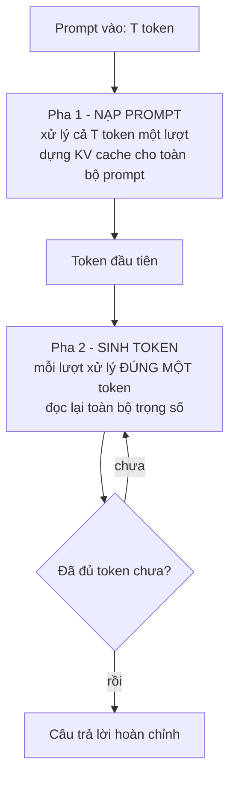

> **Mục tiêu bài học:** Sau bài này, bạn sẽ biết một lần gọi mô hình ngôn ngữ thực chất gồm **hai pha có bản chất khác hẳn nhau**, gọi đúng tên năm đại lượng dùng xuyên suốt cả chương, và giải thích được bằng số đo vì sao cùng một mô hình trên cùng một card lại chạy nhanh gấp trăm lần ở pha này so với pha kia.

Chương Generative AI đã dựng xong một hệ hỏi đáp chạy được. Nhưng "chạy được" và "phục vụ được" là hai chuyện khác nhau. Chương này bắt đầu từ chỗ ấy: mô hình đã có, giờ làm sao để nó đủ nhanh, đủ rẻ, và khi hỏng thì biết hỏng ở đâu.

Mọi thứ trong chương đều quy về một câu hỏi: **một lần gọi mô hình tốn gì.** Trả lời được câu ấy thì mười một bài sau chỉ là hệ quả.

## 1. Một lần gọi là hai pha, không phải một

Khi bạn gửi một prompt và nhận về một câu trả lời, mô hình làm hai việc rất khác nhau.

**Pha nạp prompt** (*prefill*) nhận cả prompt cùng lúc. Nếu prompt dài 4.000 token thì mô hình xử lý 4.000 token ấy **song song trong một lượt chạy**. Đây là phép nhân ma trận lớn, đúng thứ mà card đồ họa sinh ra để làm.

**Pha sinh token** (*decode*) thì ngược hẳn. Nó buộc phải tuần tự: muốn biết token thứ 51 thì phải có token thứ 50 trước đã. Mỗi lượt chỉ xử lý **một** token, nhưng vẫn phải chạy qua **toàn bộ** mô hình.

Đó là gốc rễ của mọi chuyện trong chương này. Bài 02 sẽ cho thấy KV cache khiến pha hai không phải tính lại từ đầu; bài 05 cho thấy gộp lô cứu được sự lãng phí của pha hai; bài 08 cho thấy vì sao truyền theo luồng đổi cảm nhận của người dùng mà không đổi tốc độ máy.

## 2. Năm đại lượng, gọi cho đúng tên

Cả chương này sẽ dùng đúng năm cái tên sau. Gọi sai tên là đo sai thứ, và chẩn đoán sai chỗ.

| Đại lượng | Nghĩa | Thuộc pha |
|---|---|---|
| **TTFT** - *time to first token* | Từ lúc yêu cầu **đến** tới lúc có token đầu tiên - **gồm cả** thời gian chờ hàng đợi | Chờ hàng đợi + pha nạp prompt |
| **TPOT** hay **ITL** - *time per output token / inter-token latency* | Khoảng cách giữa hai token liên tiếp | Pha sinh token |
| **E2E** - *end-to-end latency* | Tổng thời gian cả yêu cầu | Cả hai |
| **Thời gian chờ hàng đợi** - *queue time* | Yêu cầu nằm chờ trước khi được xử lý - **một phần của TTFT** | Trước cả hai |
| **Thông lượng** - *throughput* | Số token (hoặc yêu cầu) hệ xử lý xong mỗi giây | Cả hệ |

Quan hệ giữa chúng, với một yêu cầu sinh ra $N$ token:

$$\text{E2E} \approx \text{TTFT} + (N - 1) \times \text{TPOT}$$

Khi cần mổ xẻ, tách thời gian của một yêu cầu thành các khúc:

$$\text{E2E} \approx \underbrace{\text{chờ hàng đợi} + \text{nạp prompt}}_{\approx\ \text{TTFT}} + \text{sinh token} + \text{chi phí khác}$$

Chỗ phải nói rõ là **đồng hồ bắt đầu ở đâu**. Cả chương này dùng một quy ước: TTFT tính từ lúc yêu cầu **đến**, nên nó đã **chứa** thời gian chờ hàng đợi - không được cộng thêm lần nữa. Có những bộ máy còn xuất một con số khác, tính từ lúc yêu cầu **được lập lịch** tới token đầu, tức không gồm hàng đợi. Cả hai hay được gọi chung là "TTFT"; gặp con số nào thì phải hỏi nó bắt đầu từ đâu.

Đọc hai công thức này là thấy ngay ba điều mà bài 07 và bài 11 sẽ khai thác. Một yêu cầu có prompt dài mà trả lời ngắn thì **TTFT chiếm gần hết E2E**. Một yêu cầu prompt ngắn mà trả lời dài thì **TPOT chiếm gần hết**. Và khi TTFT cao, câu hỏi tiếp theo luôn là **cao vì chờ hay cao vì nạp**: chờ cao là hệ đang quá tải, nạp cao là prompt dài - hai bệnh khác nhau, hai cách chữa khác nhau.

## 3. Đo trên máy thật

Tất cả số trong bài này đo trên một máy cụ thể, và tôi ghi rõ cấu hình vì **không con số nào trong chương này mang sang máy khác được nguyên vẹn**.

| | |
|---|---|
| GPU | NVIDIA GeForce RTX 3060, 12,49 GB, 28 SM, compute capability 8.6 |
| Driver / CUDA | 575.57.08 / 12.8 · PyTorch 2.10.0 |
| Mô hình | Qwen2.5-1.5B-Instruct, **bfloat16**, 1.543.714.304 tham số |
| Trọng số | 3,087 GB |
| Cách chạy | Vòng lặp thủ công trên `transformers`, batch 1, sinh 96 token, 5 lượt lấy trung vị |
| Tình trạng GPU | Trước khi chạy: 52 MiB đang dùng, xung nhịp ở mức nghỉ. Có hai tiến trình của người khác trên máy, tổng dưới 280 MiB và không hoạt động |

Kết quả, quét prompt từ 64 tới 4.096 token:

| Prompt (token) | TTFT (s) | TPOT p50 (ms) | TPOT p95 (ms) | Nạp prompt (tok/s) | Sinh token (tok/s) | VRAM đỉnh (GB) |
|---|---|---|---|---|---|---|
| 64 | 0,0196 | 17,27 | 30,11 | 3.262 | 57,9 | 3,12 |
| 256 | 0,0437 | 17,79 | 33,12 | 5.857 | 56,2 | 3,19 |
| 1.024 | 0,1551 | 17,19 | 33,81 | **6.602** | 58,2 | 3,44 |
| 4.096 | 0,6379 | 17,31 | 33,37 | 6.421 | 57,8 | 4,47 |

Ba điều đập vào mắt.

**Chênh lệch hơn trăm lần giữa hai pha.** Ở prompt 1.024, mô hình nạp được **6.602 token mỗi giây** nhưng chỉ sinh được **58 token mỗi giây**. Cùng một mô hình, cùng một card, cùng một lần chạy - **chênh 114 lần**. Mục 4 giải thích vì sao.

**TPOT gần như không đổi.** Prompt tăng **64 lần**, từ 64 lên 4.096 token, mà thời gian sinh mỗi token vẫn nằm trong khoảng 17,2-17,8 ms. Nói cách khác, **prompt dài làm TTFT đắt lên chứ gần như không làm từng token sau đó chậm đi** - ít nhất ở dải độ dài này và ở batch 1. Đây là lý do một trợ lý có prompt hệ thống dài ngoằng vẫn gõ ra chữ với tốc độ bình thường; cái nó mất là khoảng lặng lúc đầu.

**TTFT tăng chậm hơn độ dài prompt.** Prompt gấp 64 lần nhưng TTFT chỉ gấp 32,5 lần. Vì ở prompt ngắn, card chưa được dùng hết - 3.262 token/s ở prompt 64 so với 6.602 ở prompt 1.024. Prompt càng dài thì phép nhân ma trận càng "béo" và card càng chạy đúng sức. Sau 1.024 thì bão hòa: 4.096 token còn hơi chậm lại.

> ⚠️ **Bảng này là một lần chạy, một mô hình, một card, batch 1.** Nó mô tả *hình dạng* của vấn đề, không phải bảng thông số của phần cứng. Bài 05 sẽ cho thấy nhiều con số ở đây đổi hẳn khi batch lớn lên.

## 4. Vì sao hai pha khác nhau đến thế

Câu trả lời quen thuộc là: *"nạp prompt nghẽn ở tính toán, sinh token nghẽn ở băng thông bộ nhớ."* Câu ấy đúng phần lớn trường hợp, nhưng nói suông thì không kiểm được. Hãy biến nó thành số.

**Mật độ tính toán.** Với mỗi byte trọng số đọc từ bộ nhớ, phép tính làm được bao nhiêu phép toán? Đại lượng này gọi là **mật độ tính toán** (*arithmetic intensity*).

Sinh một token cần khoảng $2P$ phép toán, với $P$ là số tham số. Và nó phải **đọc toàn bộ trọng số một lượt**, tức $2P$ byte ở bf16. Vậy:

$$\text{mật độ khi sinh (batch 1)} = \frac{2P}{2P} = 1 \text{ FLOP/byte}$$

Nạp prompt $T$ token cũng chỉ đọc trọng số **một lượt duy nhất** - vì cả $T$ token dùng chung bộ trọng số ấy - nhưng làm gấp $T$ lần số phép toán:

$$\text{mật độ khi nạp} = \frac{2PT}{2P} = T \text{ FLOP/byte}$$

**Máy này cân bằng ở đâu.** Tôi đo thẳng hai cái trần của chính card này thay vì tra thông số công bố: nhân hai ma trận bf16 cỡ 8192×8192, và chép một khối bộ nhớ 1 GB.

| Trần đo được | Giá trị |
|---|---|
| Tính toán bf16 | **27,63 TFLOP/s** |
| Băng thông bộ nhớ | **318,3 GB/s** |

Chia hai số ấy cho nhau được **điểm cân bằng của máy**:

$$\frac{27{,}63 \times 10^{12}}{318{,}3 \times 10^{9}} = 86{,}8 \text{ FLOP/byte}$$

Việc nào có mật độ **dưới** 86,8 thì máy đọc bộ nhớ xong mà chưa kịp tính hết - nghẽn ở **băng thông**. Việc nào **trên** 86,8 thì ngược lại - nghẽn ở **tính toán**.

Sinh token ở batch 1 có mật độ **1 FLOP/byte**, tức thấp hơn điểm cân bằng gần **87 lần**. Không cần đo thêm cũng biết nó nghẽn ở đâu. Nhưng ta có số đo, nên cứ đối chiếu.

> ⚠️ **Các số FLOP/byte và GB/s trong bảng dưới là ước lượng bậc một, không phải bộ đếm phần cứng.** Cột tính toán lấy $2P$ phép toán nhân với số token mỗi giây; cột băng thông lấy **số byte trọng số** nhân với số lượt đọc trọng số mỗi giây. Chúng cố ý bỏ qua lưu lượng của KV cache, hoạt hóa, vùng tạm và việc bộ nhớ đệm trên chip nạp lại - để có một mô hình đơn giản dự đoán được. Lưu lượng bộ nhớ thật của card cao hơn con số ở cột băng thông; muốn đo nó phải dùng công cụ đọc bộ đếm phần cứng, việc bài này không làm.

| Pha | Tính toán hiệu dụng (TFLOP/s) | % trần tính toán | Băng thông trọng số hiệu dụng (GB/s) | % trần băng thông |
|---|---|---|---|---|
| Nạp prompt, 64 token | 10,07 | 36,5% | 157,5 | 49,5% |
| Nạp prompt, 256 token | 18,08 | 65,4% | 70,7 | 22,2% |
| Nạp prompt, 1.024 token | 20,38 | **73,8%** | 19,9 | 6,3% |
| Nạp prompt, 4.096 token | 19,82 | 71,7% | 4,8 | 1,5% |
| **Sinh token, batch 1** | 0,178 | **0,65%** | 178,5 | **56,1%** |

Đọc dòng cuối cho kỹ. Khi sinh token, card chạy ở **0,65% khả năng tính toán** của nó. Nó gần như không tính gì cả - nó đang bận **khiêng 3,087 GB trọng số từ bộ nhớ về nhân 58 lần mỗi giây**. Bạn mua một cỗ máy tính toán rồi dùng nó làm băng chuyền.

Còn dòng prompt 1.024: **73,8% trần tính toán** mà chỉ **6,3% băng thông**. Cùng mô hình, cùng card, ngược hẳn.

**Và đây là chỗ dữ liệu bắt ta phải nói cẩn thận.** Điểm cân bằng 86,8 FLOP/byte dự đoán rằng nạp prompt chỉ *thật sự* nghẽn ở tính toán khi prompt dài **hơn khoảng 87 token**. Nhìn lại bảng: ở prompt **64** - dưới ngưỡng ấy - nạp prompt đạt 36,5% trần tính toán nhưng **49,5% trần băng thông**, tức nó nghiêng về phía băng thông. Từ 256 token trở lên mới lật hẳn sang phía tính toán.

Nên câu nói đúng **không phải** *"nạp prompt nghẽn tính toán"* như một định luật, mà là: *"nạp prompt **thường** nghẽn tính toán, vì prompt thực tế thường dài hơn điểm cân bằng của máy khá nhiều."* Ranh giới ấy có thật, tính ra được, và bài 05 sẽ cho thấy **batch lớn cũng đẩy pha sinh token vượt qua chính ranh giới này** - lúc ấy pha sinh cũng thành nghẽn tính toán, và mọi trực giác từ bài này phải đo lại.

> 🔧 **Thử ngay:** đồng nghiệp bảo *"mua card mạnh gấp đôi thì trợ lý gõ chữ nhanh gấp đôi"*. Bạn phản biện thế nào?
> Hỏi **mạnh gấp đôi ở chỗ nào**. Tốc độ gõ chữ do pha sinh token quyết định, mà pha ấy ở batch 1 chạy ở 0,65% khả năng tính toán và 56% băng thông. Card có nhân tính toán gấp đôi mà băng thông y hệt thì tốc độ gõ chữ **gần như không đổi**; card có băng thông gấp đôi thì mới nhanh lên. Còn nếu bài toán của bạn là prompt dài trả lời ngắn - tóm tắt tài liệu chẳng hạn - thì ngược lại, nhân tính toán mới là thứ đáng tiền. Đây là lý do phải biết **bài toán của mình nằm ở pha nào** trước khi mua gì.

## 5. Cùng phép đo ấy trên CPU

Con số CPU không đặt ở đây để so hơn thua. Nó ở đây để kiểm một câu hỏi cụ thể: **điểm cân bằng của máy có thật sự chi phối khoảng cách giữa hai pha không?**

Phép đo này chạy trên **một máy khác** - máy tính cá nhân 8 nhân, PyTorch dùng 4 luồng, float32, tải máy ở mức nghỉ. Tôi chuyển sang máy này vì lúc đo, máy chủ GPU có **tải trung bình 50 trên 20 nhân** do người khác đang chạy việc nặng, và số CPU đo trong điều kiện ấy không dùng được.

| | GPU, bf16 | CPU, float32 |
|---|---|---|
| Trọng số | 3,087 GB | **6,17 GB** |
| TTFT ở prompt 1.024 | 0,155 s | 13,785 s |
| TPOT p50 | 17,19 ms | 289,4 ms |
| Nạp prompt 1.024 token | 6.602 tok/s | 74,3 tok/s |
| Sinh token | 58,2 tok/s | 3,45 tok/s |
| **Tỉ lệ nạp ÷ sinh** | **114×** | **21,5×** |
| Trần tính toán | 27,63 TFLOP/s | 346,1 GFLOP/s |
| Trần băng thông | 318,3 GB/s | 16,0 GB/s |
| **Điểm cân bằng** | **86,8 FLOP/byte** | **21,6 FLOP/byte** |

**Hướng thì giống, độ lớn thì không.** Trên cả hai máy, nạp prompt nhanh hơn sinh token rất nhiều lần - vì lý do nằm ở *cấu trúc phép tính*, không nằm ở loại chip. Nhưng khoảng cách ấy **không giữ nguyên**: 114 lần trên GPU, chỉ 21,5 lần trên CPU.

Đó đúng là điều điểm cân bằng dự đoán. Máy nào có tỉ lệ tính-toán-trên-băng-thông thấp hơn thì hai pha nằm gần nhau hơn, vì pha nạp prompt chạm trần tính toán sớm hơn. Điểm cân bằng của CPU này thấp hơn GPU **4 lần** (21,6 so với 86,8), và khoảng cách hai pha hẹp lại **5,3 lần**. Cùng hướng, cùng cỡ độ lớn.

Nếu tôi chỉ viết *"tỉ lệ giữa hai pha giữ nguyên trên mọi phần cứng"* thì câu ấy nghe gọn hơn nhiều - và sai. Số đo bắt phải nói khác.

> ⚠️ **Một chỗ phép đo của tôi không khớp, và nó đáng nói ra.** Khi sinh token, CPU đạt **21,3 GB/s**, tức **cao hơn** con số 16,0 GB/s mà tôi vừa gọi là "trần băng thông". Không có phép màu nào ở đây: **cách tôi đo trần mới là cái sai**. Tôi đo bằng phép chép khối bộ nhớ, mà chép thì vừa đọc vừa ghi; còn sinh token thì gần như chỉ **đọc**. Trên CPU hai kiểu truy cập ấy cho ra con số khác nhau đủ nhiều để làm hỏng phép so sánh. Nên với CPU tôi **không** quy ra phần trăm trần như đã làm ở mục 4, chỉ dùng điểm cân bằng để so *tương đối* giữa hai máy. Quy tắc chung: hiệu suất vượt quá 100% trần không bao giờ có nghĩa là máy chạy quá sức, nó có nghĩa **cái trần bạn đo bị sai**.

Còn một chi tiết nhỏ mà hai bài sau sẽ sống chết với nó: trên CPU mô hình chiếm **6,17 GB** thay vì 3,087 GB, đúng gấp đôi, vì float32 dùng 4 byte mỗi tham số thay vì 2.

## 6. Cái này đổi gì cho việc thật

**Tối ưu sai pha là phí công.** Nếu hệ của bạn nhận prompt 4.000 token rồi trả lời 50 token, thì E2E ≈ 0,64 + 49 × 0,017 ≈ **1,47 giây**, trong đó pha nạp chiếm 44%. Rút ngắn prompt là việc đáng làm. Nhưng nếu hệ nhận prompt 200 token rồi trả lời 800 token, E2E ≈ 0,04 + 799 × 0,017 ≈ **13,6 giây**, pha nạp chỉ chiếm 0,3% - lúc ấy rút prompt chẳng cứu được gì, mà phải nhắm vào pha sinh.

**Một con số trung bình che mất cả hai pha.** "Trung bình 2 giây mỗi yêu cầu" không cho biết cần sửa gì. Tách ra TTFT và TPOT thì biết ngay. Bài 11 xây cả một bảng chẩn đoán trên đúng nguyên tắc này.

**Đừng đọc TPOT p95 như nhiễu đo.** Trong bảng mục 3, TPOT p95 cao gần gấp đôi p50 ở mọi độ dài - 17 ms so với 33 ms. Một nguyên nhân hợp lý là chi phí của vòng lặp Python và việc khởi động nhân tính toán từng bước một - thứ mà một bộ máy phục vụ chuyên dụng thu hồi được một phần - nhưng bảng này chưa tách được nó khỏi các nguyên nhân khác. Bài 06 cho thấy một bộ máy chuyên dụng nhanh hơn vòng lặp tự viết bao nhiêu trên cùng một tải.

**Còn 44% băng thông trọng số bỏ trống thì sao?** Pha sinh token chỉ đạt 56,1% trần băng thông - tính theo lưu lượng trọng số - chứ không phải 95%. Phép đo này **một mình không phân rã được** khoảng cách ấy. Nó có thể đến từ nhiều chỗ: mỗi bước sinh phải quay lại Python và khởi động nhân tính toán, bản thân nhân tính toán chưa tận dụng hết băng thông, cách truy cập bộ nhớ, lưu lượng KV và hoạt hóa mà cột này không tính, bộ nhớ đệm trên chip, các lần đồng bộ. Một phần chắc chắn là chi phí phần mềm - các bài sau cho thấy bộ máy phục vụ chuyên dụng nhanh hơn hẳn vòng lặp tự viết - nhưng bao nhiêu phần thì bài này chưa đo.

## Tóm tắt bài học

- Một lần gọi mô hình gồm **hai pha khác hẳn nhau**: nạp prompt xử lý cả $T$ token song song, sinh token xử lý đúng một token mỗi lượt nhưng vẫn chạy qua toàn bộ mô hình.
- Cả chương dùng năm cái tên: **TTFT · TPOT/ITL · E2E · thời gian chờ hàng đợi · thông lượng**, với $\text{E2E} \approx \text{TTFT} + (N-1)\times\text{TPOT}$, trong đó **TTFT tính từ lúc yêu cầu đến nên đã gồm thời gian chờ hàng đợi** - không cộng thêm lần nữa.
- Đo trên Qwen2.5-1.5B bf16 / RTX 3060: nạp prompt **6.602 tok/s**, sinh token **57,8 tok/s** - **chênh 114 lần** trên cùng một card, cùng một lần chạy.
- **TPOT gần như không đổi** (17,2-17,8 ms) khi prompt tăng 64 lần. Prompt dài làm TTFT đắt lên, gần như không làm từng token sau đó chậm đi - ở batch 1, trong dải độ dài này.
- Lý do đo được, không phải suy đoán: **điểm cân bằng của card này là 86,8 FLOP/byte** (27,63 TFLOP/s ÷ 318,3 GB/s, cả hai đều đo trực tiếp). Sinh token ở batch 1 có mật độ **1 FLOP/byte**, thấp hơn gần 87 lần.
- Đối chiếu: khi sinh token card chạy ở **0,65% trần tính toán** nhưng **56,1% trần băng thông** (ước lượng bậc một từ lưu lượng trọng số, không phải bộ đếm phần cứng); khi nạp prompt 1.024 token thì **73,8% trần tính toán** và **6,3% băng thông**. Hai pha nằm trên hai cái trần khác nhau.
- Cùng phép đo trên CPU (máy khác, float32): khoảng cách hai pha **hẹp lại còn 21,5 lần** thay vì 114. Điểm cân bằng của CPU ấy là **21,6 FLOP/byte**, thấp hơn GPU 4 lần - nên **hướng giống nhau nhưng độ lớn thì không**, và không được nói tỉ lệ hai pha là hằng số.
- Ranh giới ấy **không phải định luật**: ở prompt 64 - dưới điểm cân bằng - nạp prompt lại nghiêng về phía băng thông (49,5% so với 36,5%). Nên phát biểu đúng là *"thường"*, và bài 05 sẽ cho thấy batch lớn đẩy cả pha sinh vượt qua ranh giới này.
- Pha sinh chỉ đạt khoảng 56% trần băng thông tính theo lưu lượng trọng số. Một phần khoảng cách là chi phí phần mềm của vòng lặp từng bước - các bài sau cho thấy bộ máy chuyên dụng thu hồi được một phần - nhưng phép đo này một mình không phân rã được phần còn lại.

## Câu hỏi tự kiểm tra

1. Vì sao pha nạp prompt xử lý được cả nghìn token mỗi giây còn pha sinh token chỉ được vài chục, dù cùng một mô hình và cùng một card?
2. Một hệ có TTFT cao bất thường. Hai đại lượng nào tách được nguyên nhân, và mỗi trường hợp chữa theo hướng nào?
3. Tính mật độ tính toán khi sinh một token ở batch 1 với mô hình bf16, và giải thích vì sao nó không phụ thuộc vào số tham số.
4. Điểm cân bằng của card trong bài là 86,8 FLOP/byte. Một card khác có trần tính toán 300 TFLOP/s và băng thông 2.000 GB/s thì điểm cân bằng là bao nhiêu, và điều đó nói gì về việc prompt phải dài bao nhiêu mới nghẽn ở tính toán?
5. Bảng ở mục 4 cho thấy nạp prompt 64 token nghiêng về phía **băng thông**. Điều đó mâu thuẫn với câu "nạp prompt nghẽn tính toán" không? Phát biểu lại cho đúng.
6. Hệ A nhận prompt 4.000 token trả lời 50 token; hệ B nhận prompt 200 token trả lời 800 token. Với số đo trong bài, tính E2E của mỗi hệ và nói rõ nên tối ưu chỗ nào cho từng hệ.
7. Vì sao tăng gấp đôi số nhân tính toán của card gần như không làm tốc độ gõ chữ của một trợ lý nhanh lên, trong khi tăng gấp đôi băng thông thì có?
8. TPOT p95 cao gần gấp đôi p50 trong mọi dòng của bảng. Nêu một nguyên nhân hợp lý, và cách kiểm chứng nó.
9. Ở mục 5, pha sinh token trên CPU đạt 21,3 GB/s trong khi "trần băng thông" đo được là 16,0 GB/s. Giải thích vì sao con số ấy không chứng minh máy chạy vượt khả năng, và nêu phép đo trần nào sẽ đúng hơn cho trường hợp này.
10. Khoảng cách giữa hai pha là 114 lần trên GPU nhưng chỉ 21,5 lần trên CPU. Dùng điểm cân bằng của hai máy để giải thích, và nói rõ vì sao **không** được phát biểu tỉ lệ ấy như một hằng số.

## Đọc thêm

**Nguồn nền tảng của bài:**

| Nguồn | Đọc phần nào |
|---|---|
| **Chương Generative AI · Bài 01** | Vì sao mô hình phải sinh tuần tự từng token |
| **Chương Generative AI · Bài 03** | Attention và KV - nền cho bài 02 của chương này |
| **Chương Deep Learning · Bài 06** | Đọc số đo có nhiễu, và vì sao đừng phản ứng với một điểm |

**Đi sâu hơn:**

- [Williams, Waterman & Patterson - Roofline: An Insightful Visual Performance Model (CACM 2009)](https://dl.acm.org/doi/10.1145/1498765.1498785) - nguồn gốc của điểm cân bằng và mật độ tính toán dùng ở mục 4.
- [NVIDIA - Matrix Multiplication Background User's Guide](https://docs.nvidia.com/deeplearning/performance/dl-performance-matrix-multiplication/index.html) - vì sao ma trận "béo" chạy nhanh hơn ma trận "gầy", giải thích cột nạp prompt trong bảng mục 3.
- [Pope et al. - Efficiently Scaling Transformer Inference (MLSys 2023)](https://arxiv.org/abs/2211.05102) - phân tích hai pha ở quy mô lớn, và các đánh đổi mà bài 05 và bài 06 sẽ gặp lại.

**Mã nguồn của bài:** [`code/b01_giai_phau.py`](../../code/ai-systems/b01_giai_phau.py) - đo TTFT/TPOT/E2E trên GPU; [`code/b01_cpu.py`](../../code/ai-systems/b01_cpu.py) - cùng phép đo trên CPU; [`code/b01_tran.py`](../../code/ai-systems/b01_tran.py) và [`code/b01_tran_cpu.py`](../../code/ai-systems/b01_tran_cpu.py) - đo trần tính toán và trần băng thông của chính máy bạn đang dùng, để tự tính điểm cân bằng.

> **Bài tiếp theo:** [KV cache](../kv-cache-vi/) - pha sinh token phải chạy qua toàn bộ mô hình cho mỗi token, nhưng nó **không** phải tính lại toàn bộ ngữ cảnh - vì có KV cache. Bài sau tính trước kích thước của bộ nhớ đệm ấy bằng công thức, rồi mới đo, và cho thấy vì sao nó là một trong những thứ quyết định bạn phục vụ được bao nhiêu người cùng lúc.
