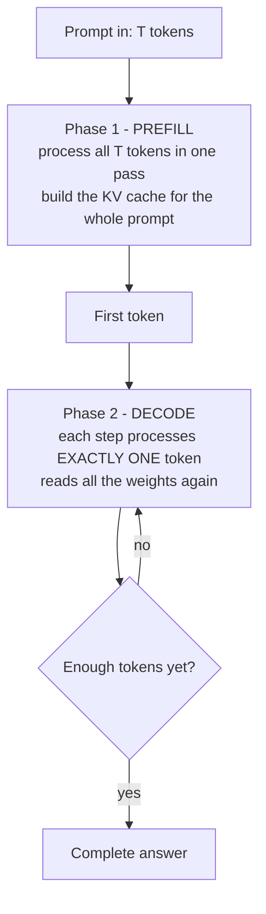

> **Learning objectives:** After this lesson, you will know that a single language model call really consists of **two phases of a completely different nature**, you will be able to name correctly the five quantities used throughout this chapter, and you will be able to explain with measurements why the same model on the same GPU runs a hundred times faster in one phase than in the other.

The Generative AI chapter built a question-answering system that works. But "it works" and "it can be served" are two different things. This chapter starts right there: the model exists, so how do we make it fast enough, cheap enough, and, when it breaks, know where it broke.

Everything in this chapter comes back to one question: **what does one model call cost.** Answer that and the next eleven lessons are just consequences.

## 1. A call is two phases, not one

When you send a prompt and get back an answer, the model does two very different jobs.

**The prefill phase** takes the whole prompt at once. If the prompt is 4,000 tokens long, the model processes those 4,000 tokens **in parallel in a single forward pass**. This is large matrix multiplication, exactly what graphics cards were built to do.

**The decode phase** is the exact opposite. It is forced to be sequential: to know token 51 you must first have token 50. Each step processes only **one** token, but it still has to run through the **entire** model.

That is the root of everything in this chapter. Lesson 02 will show that the KV cache spares phase two from recomputing from scratch; lesson 05 shows that batching rescues the waste of phase two; lesson 08 shows why streaming changes what the user perceives without changing the machine's speed.

## 2. Five quantities, named correctly

This whole chapter uses exactly the following five names. Use the wrong name and you measure the wrong thing, and diagnose the wrong place.

| Quantity | Meaning | Phase |
|---|---|---|
| **TTFT** - *time to first token* | From when the request **arrives** until the first token exists - **including** queue time | Queue wait + prefill |
| **TPOT** or **ITL** - *time per output token / inter-token latency* | The gap between two consecutive tokens | Decode |
| **E2E** - *end-to-end latency* | Total time for the whole request | Both |
| **Queue time** | Time the request sits waiting before it is processed - **part of TTFT** | Before both |
| **Throughput** | Tokens (or requests) the system finishes per second | Whole system |

How they relate, for a request that generates $N$ tokens:

$$\text{E2E} \approx \text{TTFT} + (N - 1) \times \text{TPOT}$$

When you need to dissect it, split a request's time into segments:

$$\text{E2E} \approx \underbrace{\text{queue wait} + \text{prefill}}_{\approx\ \text{TTFT}} + \text{decode} + \text{other overhead}$$

What must be stated clearly is **where the clock starts**. This whole chapter uses one convention: TTFT counts from when the request **arrives**, so it already **contains** the queue time - do not add it a second time. Some engines also report a different number, counted from when the request **is scheduled** to the first token, which excludes the queue. Both are often just called "TTFT"; whenever you see such a number, ask where it starts.

Read these two formulas and three things that lessons 07 and 11 will exploit are immediately visible. A request with a long prompt and a short answer has **TTFT taking up almost all of E2E**. A request with a short prompt and a long answer has **TPOT taking up almost all of it**. And when TTFT is high, the next question is always **high because of waiting or high because of prefill**: high waiting means the system is overloaded, high prefill means a long prompt - two different illnesses, two different cures.

## 3. Measuring on a real machine

All numbers in this lesson were measured on one specific machine, and I state the configuration explicitly because **no number in this chapter carries over to another machine intact**.

| | |
|---|---|
| GPU | NVIDIA GeForce RTX 3060, 12.49 GB, 28 SM, compute capability 8.6 |
| Driver / CUDA | 575.57.08 / 12.8 · PyTorch 2.10.0 |
| Model | Qwen2.5-1.5B-Instruct, **bfloat16**, 1,543,714,304 parameters |
| Weights | 3.087 GB |
| How it was run | Hand-written loop on `transformers`, batch 1, generating 96 tokens, median of 5 runs |
| GPU state | Before running: 52 MiB in use, clocks at idle. Two processes belonging to other people on the machine, under 280 MiB in total and inactive |

Results, sweeping the prompt from 64 to 4,096 tokens:

| Prompt (tokens) | TTFT (s) | TPOT p50 (ms) | TPOT p95 (ms) | Prefill (tok/s) | Decode (tok/s) | Peak VRAM (GB) |
|---|---|---|---|---|---|---|
| 64 | 0.0196 | 17.27 | 30.11 | 3,262 | 57.9 | 3.12 |
| 256 | 0.0437 | 17.79 | 33.12 | 5,857 | 56.2 | 3.19 |
| 1,024 | 0.1551 | 17.19 | 33.81 | **6,602** | 58.2 | 3.44 |
| 4,096 | 0.6379 | 17.31 | 33.37 | 6,421 | 57.8 | 4.47 |

Three things jump out.

**More than a hundredfold gap between the two phases.** At a 1,024-token prompt, the model prefills **6,602 tokens per second** but decodes only **58 tokens per second**. Same model, same GPU, same run - **a 114x gap**. Section 4 explains why.

**TPOT is almost constant.** The prompt grows **64 times**, from 64 to 4,096 tokens, yet the time to generate each token stays within 17.2-17.8 ms. In other words, **a long prompt makes TTFT more expensive but barely makes each subsequent token slower** - at least in this length range and at batch 1. This is why an assistant with a very long system prompt still types out text at normal speed; what it loses is the silence at the start.

**TTFT grows more slowly than prompt length.** The prompt is 64 times longer but TTFT is only 32.5 times longer. That is because with short prompts the GPU is not fully used - 3,262 tokens/s at a 64-token prompt versus 6,602 at 1,024. The longer the prompt, the "fatter" the matrix multiplication and the closer the GPU runs to full capacity. Past 1,024 it saturates: 4,096 tokens is even slightly slower.

> ⚠️ **This table is one run, one model, one GPU, batch 1.** It describes the *shape* of the problem, not a hardware spec sheet. Lesson 05 will show that many of these numbers change completely as the batch grows.

## 4. Why the two phases differ so much

The familiar answer is: *"prefill is compute-bound, decode is memory-bandwidth-bound."* That statement is right in most cases, but said flatly it cannot be checked. Let us turn it into numbers.

**Arithmetic intensity.** For each byte of weights read from memory, how many operations does the computation perform? This quantity is called **arithmetic intensity**.

Generating one token takes about $2P$ operations, where $P$ is the number of parameters. And it has to **read all the weights once**, that is $2P$ bytes in bf16. So:

$$\text{intensity when decoding (batch 1)} = \frac{2P}{2P} = 1 \text{ FLOP/byte}$$

Prefilling a $T$-token prompt also reads the weights **only once** - because all $T$ tokens share the same set of weights - but does $T$ times as many operations:

$$\text{intensity when prefilling} = \frac{2PT}{2P} = T \text{ FLOP/byte}$$

**Where this machine balances.** I directly measured the two ceilings of this very GPU instead of looking up published specs: multiplying two 8192×8192 bf16 matrices, and copying a 1 GB block of memory.

| Measured ceiling | Value |
|---|---|
| bf16 compute | **27.63 TFLOP/s** |
| Memory bandwidth | **318.3 GB/s** |

Dividing one by the other gives the **machine's balance point**:

$$\frac{27.63 \times 10^{12}}{318.3 \times 10^{9}} = 86.8 \text{ FLOP/byte}$$

A workload with intensity **below** 86.8 means the machine finishes reading memory before it has finished computing - it is bound by **bandwidth**. A workload **above** 86.8 is the reverse - bound by **compute**.

Decoding at batch 1 has an intensity of **1 FLOP/byte**, nearly **87 times** below the balance point. You know where it is bottlenecked without measuring anything else. But we have measurements, so let us check against them anyway.

> ⚠️ **The FLOP/byte and GB/s numbers in the table below are first-order estimates, not hardware counters.** The compute column takes $2P$ operations times tokens per second; the bandwidth column takes **the number of weight bytes** times the number of weight reads per second. They deliberately ignore traffic from the KV cache, activations, scratch buffers and on-chip cache refills - to get a simple model that can make predictions. The GPU's real memory traffic is higher than the bandwidth column; measuring it requires a tool that reads hardware counters, which this lesson does not do.

| Phase | Effective compute (TFLOP/s) | % of compute ceiling | Effective weight bandwidth (GB/s) | % of bandwidth ceiling |
|---|---|---|---|---|
| Prefill, 64 tokens | 10.07 | 36.5% | 157.5 | 49.5% |
| Prefill, 256 tokens | 18.08 | 65.4% | 70.7 | 22.2% |
| Prefill, 1,024 tokens | 20.38 | **73.8%** | 19.9 | 6.3% |
| Prefill, 4,096 tokens | 19.82 | 71.7% | 4.8 | 1.5% |
| **Decode, batch 1** | 0.178 | **0.65%** | 178.5 | **56.1%** |

Read the last row carefully. When decoding, the GPU runs at **0.65% of its compute capacity**. It is barely computing anything - it is busy **hauling 3.087 GB of weights from memory to the cores 58 times per second**. You bought a computing machine and are using it as a conveyor belt.

And the 1,024-token prompt row: **73.8% of the compute ceiling** but only **6.3% of bandwidth**. Same model, same GPU, the complete opposite.

**And this is where the data forces us to speak carefully.** The balance point of 86.8 FLOP/byte predicts that prefill is only *truly* compute-bound when the prompt is longer **than about 87 tokens**. Look at the table again: at a prompt of **64** - below that threshold - prefill reaches 36.5% of the compute ceiling but **49.5% of the bandwidth ceiling**, meaning it leans toward the bandwidth side. Only from 256 tokens upward does it flip firmly to the compute side.

So the correct statement is **not** *"prefill is compute-bound"* as a law, but: *"prefill is **usually** compute-bound, because real prompts are usually well longer than the machine's balance point."* That boundary is real and can be computed, and lesson 05 will show that **a large batch also pushes decode across this same boundary** - at that point decode becomes compute-bound too, and every intuition from this lesson has to be measured again.

> 🔧 **Try it now:** a colleague says *"buy a GPU twice as powerful and the assistant will type twice as fast"*. How do you push back?
> Ask **twice as powerful where**. Typing speed is set by the decode phase, and at batch 1 that phase runs at 0.65% of compute capacity and 56% of bandwidth. A GPU with twice the compute but identical bandwidth leaves typing speed **almost unchanged**; only a GPU with twice the bandwidth gets faster. But if your workload is a long prompt with a short answer - document summarization, for example - then it is the reverse, and compute is what is worth paying for. This is why you must know **which phase your workload lives in** before buying anything.

## 5. The same measurement on a CPU

The CPU numbers are not here to decide which is better. They are here to test one specific question: **does the machine's balance point really govern the gap between the two phases?**

This measurement runs on **a different machine** - an 8-core personal computer, PyTorch using 4 threads, float32, the machine at idle. I switched to this machine because at measurement time the GPU server had a **load average of 50 on 20 cores** from someone else running heavy jobs, and CPU numbers measured under those conditions are unusable.

| | GPU, bf16 | CPU, float32 |
|---|---|---|
| Weights | 3.087 GB | **6.17 GB** |
| TTFT at a 1,024 prompt | 0.155 s | 13.785 s |
| TPOT p50 | 17.19 ms | 289.4 ms |
| Prefill 1,024 tokens | 6,602 tok/s | 74.3 tok/s |
| Decode | 58.2 tok/s | 3.45 tok/s |
| **Prefill ÷ decode ratio** | **114×** | **21.5×** |
| Compute ceiling | 27.63 TFLOP/s | 346.1 GFLOP/s |
| Bandwidth ceiling | 318.3 GB/s | 16.0 GB/s |
| **Balance point** | **86.8 FLOP/byte** | **21.6 FLOP/byte** |

**The direction is the same, the magnitude is not.** On both machines, prefill is many times faster than decode - because the reason lies in the *structure of the computation*, not in the type of chip. But the gap **does not stay the same**: 114 times on the GPU, only 21.5 times on the CPU.

That is exactly what the balance point predicts. A machine with a lower compute-to-bandwidth ratio puts the two phases closer together, because prefill hits the compute ceiling sooner. This CPU's balance point is **4 times** lower than the GPU's (21.6 versus 86.8), and the gap between the phases narrows **5.3 times**. Same direction, same order of magnitude.

Had I just written *"the ratio between the two phases is the same on all hardware"*, the sentence would sound much neater - and be wrong. The measurements force a different statement.

> ⚠️ **One place where my measurements do not agree, and it is worth saying out loud.** When decoding, the CPU reaches **21.3 GB/s**, which is **higher** than the 16.0 GB/s I just called the "bandwidth ceiling". There is no magic here: **my way of measuring the ceiling is what is wrong**. I measured it with a memory block copy, and copying both reads and writes; decode, by contrast, almost only **reads**. On a CPU those two access patterns give numbers different enough to spoil the comparison. So for the CPU I do **not** convert to percentages of the ceiling as in section 4, and only use the balance point to compare the two machines *relatively*. General rule: performance above 100% of a ceiling never means the machine is running beyond its limits, it means **the ceiling you measured is wrong**.

One more small detail that the next two lessons will live or die by: on the CPU the model takes **6.17 GB** instead of 3.087 GB, exactly double, because float32 uses 4 bytes per parameter instead of 2.

## 6. What this changes in real work

**Optimizing the wrong phase is wasted effort.** If your system receives 4,000-token prompts and answers with 50 tokens, then E2E ≈ 0.64 + 49 × 0.017 ≈ **1.47 seconds**, of which prefill is 44%. Shortening the prompt is worth doing. But if the system receives 200-token prompts and answers with 800 tokens, E2E ≈ 0.04 + 799 × 0.017 ≈ **13.6 seconds**, and prefill is only 0.3% - shortening the prompt saves nothing then, and you have to target decode.

**A single average hides both phases.** "An average of 2 seconds per request" does not tell you what to fix. Split it into TTFT and TPOT and you know right away. Lesson 11 builds a whole diagnostic table on exactly this principle.

**Do not read TPOT p95 as measurement noise.** In the table in section 3, TPOT p95 is nearly double p50 at every length - 17 ms versus 33 ms. One plausible cause is the overhead of the Python loop and launching compute kernels one step at a time - something a dedicated serving engine partly recovers - but this table has not separated it from other causes. Lesson 06 shows how much faster a dedicated engine is than a hand-written loop on the same load.

**What about the 44% of weight bandwidth left unused?** Decode reaches only 56.1% of the bandwidth ceiling - measured as weight traffic - not 95%. This measurement **alone cannot break down** that gap. It could come from many places: each decode step has to return to Python and launch compute kernels, the kernels themselves do not fully use the bandwidth, the memory access pattern, KV and activation traffic that this column does not count, on-chip caches, synchronization points. Part of it is certainly software overhead - later lessons show that dedicated serving engines are much faster than a hand-written loop - but how large a part this lesson has not measured.

## Lesson summary

- A model call consists of **two completely different phases**: prefill processes all $T$ tokens in parallel, decode processes exactly one token per step but still runs through the entire model.
- The whole chapter uses five names: **TTFT · TPOT/ITL · E2E · queue time · throughput**, with $\text{E2E} \approx \text{TTFT} + (N-1)\times\text{TPOT}$, where **TTFT counts from when the request arrives and so already includes queue time** - do not add it again.
- Measured on Qwen2.5-1.5B bf16 / RTX 3060: prefill **6,602 tok/s**, decode **57.8 tok/s** - **a 114x gap** on the same GPU, in the same run.
- **TPOT is almost constant** (17.2-17.8 ms) as the prompt grows 64 times. A long prompt makes TTFT more expensive, but barely makes each subsequent token slower - at batch 1, in this length range.
- The reason is measured, not guessed: **this GPU's balance point is 86.8 FLOP/byte** (27.63 TFLOP/s ÷ 318.3 GB/s, both measured directly). Decode at batch 1 has an intensity of **1 FLOP/byte**, nearly 87 times lower.
- Cross-check: when decoding the GPU runs at **0.65% of the compute ceiling** but **56.1% of the bandwidth ceiling** (a first-order estimate from weight traffic, not hardware counters); when prefilling 1,024 tokens it is at **73.8% of the compute ceiling** and **6.3% of bandwidth**. The two phases sit under two different ceilings.
- The same measurement on a CPU (a different machine, float32): the gap between phases **narrows to 21.5 times** instead of 114. That CPU's balance point is **21.6 FLOP/byte**, 4 times lower than the GPU - so **the direction is the same but the magnitude is not**, and you must not state the phase ratio as a constant.
- That boundary is **not a law**: at a 64-token prompt - below the balance point - prefill leans toward the bandwidth side (49.5% versus 36.5%). So the correct statement says *"usually"*, and lesson 05 will show that a large batch pushes even decode across this boundary.
- Decode reaches only about 56% of the bandwidth ceiling measured as weight traffic. Part of the gap is the software overhead of the step-by-step loop - later lessons show dedicated engines recover some of it - but this measurement alone cannot break down the rest.

## Self-check questions

1. Why can prefill process thousands of tokens per second while decode manages only a few dozen, even with the same model and the same GPU?
2. A system has abnormally high TTFT. Which two quantities separate the cause, and in which direction is each case fixed?
3. Compute the arithmetic intensity of generating one token at batch 1 with a bf16 model, and explain why it does not depend on the number of parameters.
4. The balance point of the GPU in this lesson is 86.8 FLOP/byte. Another GPU has a compute ceiling of 300 TFLOP/s and bandwidth of 2,000 GB/s: what is its balance point, and what does that say about how long a prompt must be to become compute-bound?
5. The table in section 4 shows that prefilling 64 tokens leans toward the **bandwidth** side. Does that contradict the statement "prefill is compute-bound"? Restate it correctly.
6. System A receives 4,000-token prompts and answers with 50 tokens; system B receives 200-token prompts and answers with 800 tokens. Using the measurements in this lesson, compute each system's E2E and say clearly where each system should be optimized.
7. Why does doubling a GPU's compute barely make an assistant type faster, while doubling its bandwidth does?
8. TPOT p95 is nearly double p50 in every row of the table. Give one plausible cause, and a way to verify it.
9. In section 5, decode on the CPU reaches 21.3 GB/s while the measured "bandwidth ceiling" is 16.0 GB/s. Explain why that number does not prove the machine is running beyond its capacity, and name a ceiling measurement that would be more correct for this case.
10. The gap between the two phases is 114 times on the GPU but only 21.5 times on the CPU. Use the two machines' balance points to explain it, and say clearly why that ratio must **not** be stated as a constant.

## Further reading

**Foundational sources for this lesson:**

| Source | What to read |
|---|---|
| **Generative AI chapter · Lesson 01** | Why a model must generate tokens one at a time |
| **Generative AI chapter · Lesson 03** | Attention and KV - the groundwork for lesson 02 of this chapter |
| **Deep Learning chapter · Lesson 06** | Reading noisy measurements, and why not to react to a single point |

**Going further:**

- [Williams, Waterman & Patterson - Roofline: An Insightful Visual Performance Model (CACM 2009)](https://dl.acm.org/doi/10.1145/1498765.1498785) - the origin of the balance point and arithmetic intensity used in section 4.
- [NVIDIA - Matrix Multiplication Background User's Guide](https://docs.nvidia.com/deeplearning/performance/dl-performance-matrix-multiplication/index.html) - why "fat" matrices run faster than "thin" ones, explaining the prefill column in the table in section 3.
- [Pope et al. - Efficiently Scaling Transformer Inference (MLSys 2023)](https://arxiv.org/abs/2211.05102) - an analysis of the two phases at large scale, and the trade-offs that lessons 05 and 06 will meet again.

**Source code for this lesson:** [`code/b01_giai_phau.py`](../../code/ai-systems/b01_giai_phau.py) - measures TTFT/TPOT/E2E on the GPU; [`code/b01_cpu.py`](../../code/ai-systems/b01_cpu.py) - the same measurement on the CPU; [`code/b01_tran.py`](../../code/ai-systems/b01_tran.py) and [`code/b01_tran_cpu.py`](../../code/ai-systems/b01_tran_cpu.py) - measure the compute ceiling and bandwidth ceiling of the machine you are using, so you can compute its balance point yourself.

> **Next lesson:** [KV Cache](../kv-cache/) - decode has to run through the entire model for every token, but it does **not** have to recompute the whole context - thanks to the KV cache. The next lesson computes the size of that cache with a formula first, then measures it, and shows why it is one of the things that decide how many people you can serve at once.
