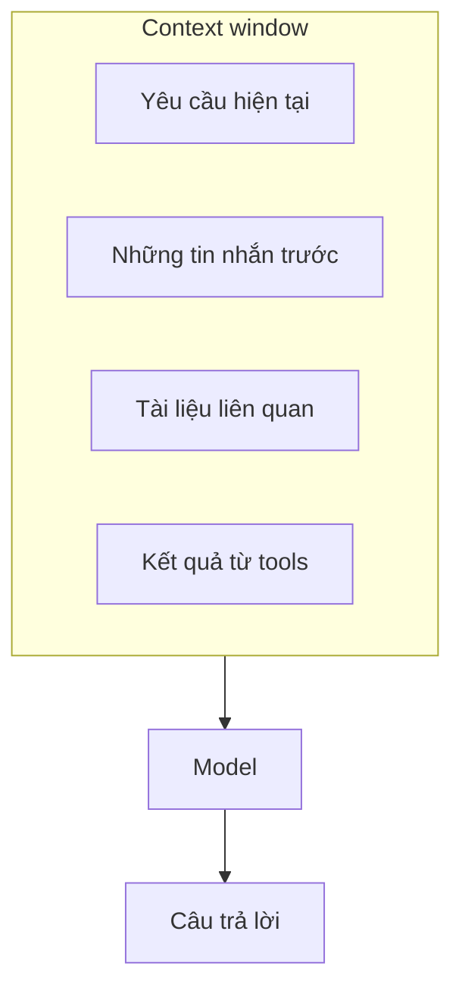
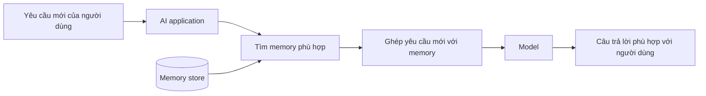
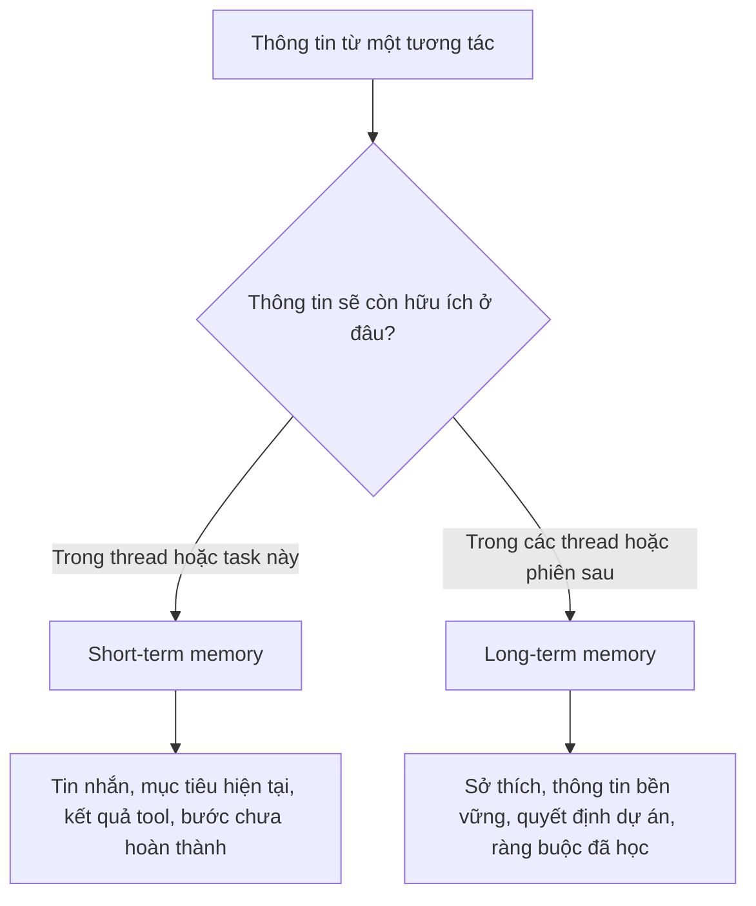
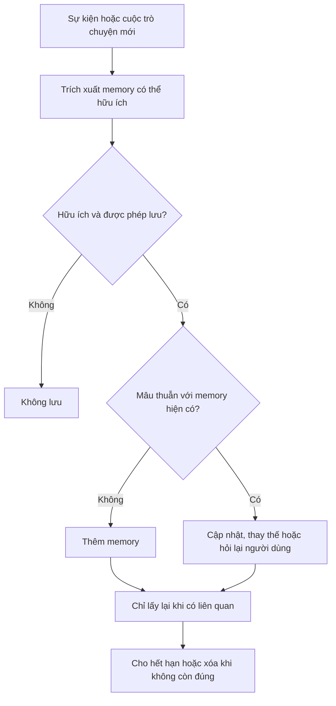
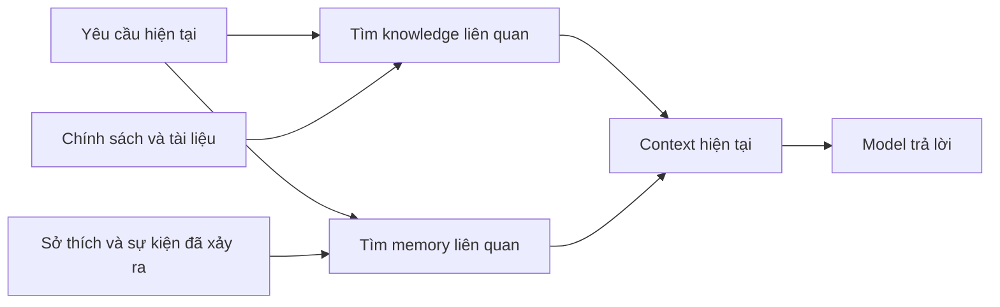
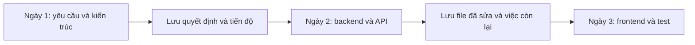
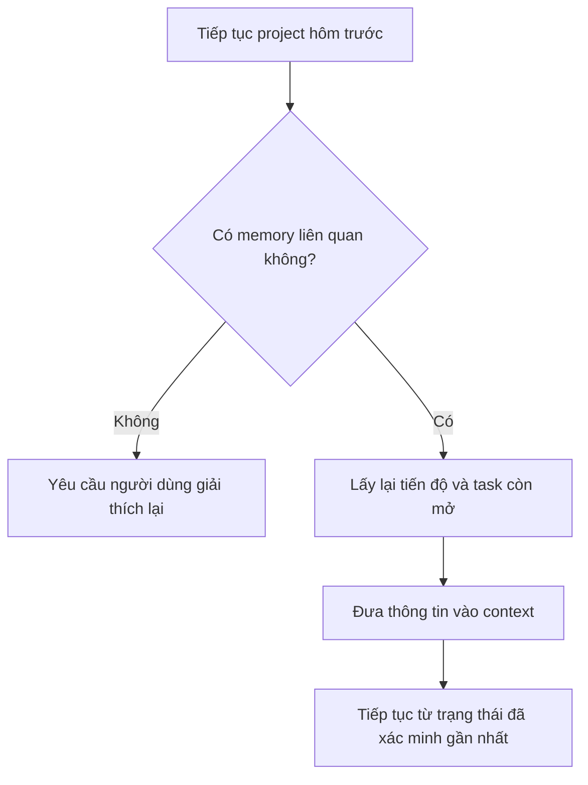
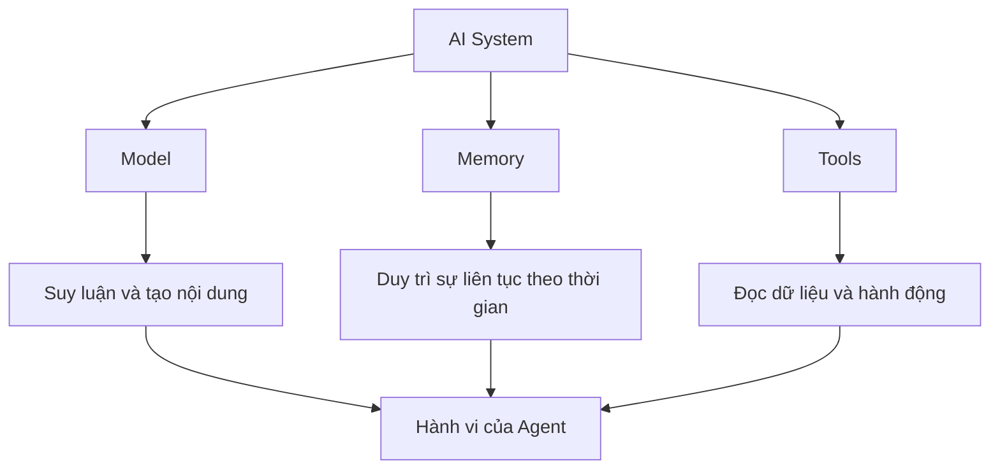

Có một trải nghiệm khá quen thuộc khi sử dụng AI.

Bạn dành thời gian giải thích dự án, nói rõ mình thích cách trình bày nào và chỉnh lại câu trả lời vài lần. Đến một lúc nào đó, AI bắt đầu hiểu bạn khá tốt.

Nhưng rồi sang một cuộc trò chuyện khác, bạn lại phải nói:

> "Dự án tôi đang làm là..."

> "Như tôi nói lần trước..."

> "Không, ý tôi không phải vậy..."

Điều này tạo ra một nghịch lý khá thú vị:

> **Một AI có thể giải những bài toán rất khó, nhưng đôi khi lại không nhớ nổi thứ bạn vừa nói hôm trước.**

Tại sao?

Bởi vì **thông minh và có trí nhớ là hai khả năng khác nhau**.

## 1. Model không nhớ cuộc trò chuyện theo cách con người nhớ

Khi chúng ta nói chuyện với một người bạn, ký ức của họ không biến mất chỉ vì cuộc trò chuyện kết thúc.

Một lần gọi model hoạt động khác. Model nhận vào một tập thông tin, xử lý chúng rồi tạo ra câu trả lời. Phần thông tin mà model có thể sử dụng tại thời điểm đó thường được gọi là **context**.

Có thể hình dung context giống như một chiếc bàn làm việc:

Model có thể sử dụng những gì đang nằm trên chiếc bàn đó. Nhưng chiếc bàn có giới hạn.

Khi cuộc trò chuyện ngày càng dài, AI application có thể phải giữ lại một số tin nhắn, tóm tắt những phần khác, loại bỏ thông tin đã cũ hoặc bắt đầu bằng một context mới. Một cuộc trò chuyện mới không tự động chứa mọi nội dung từ cuộc trò chuyện cũ, trừ khi hệ thống đã lưu và đưa chúng trở lại.

Vì vậy, điều đầu tiên cần phân biệt là:

> **Context là những gì model đang nhìn thấy. Nó chưa chắc là những gì hệ thống sẽ nhớ lâu dài.**

## 2. Context window giống bàn làm việc hơn là trí nhớ dài hạn

Hãy tưởng tượng bạn đang giải một bài toán trên bàn. Bạn đặt lên đó đề bài, vài tờ ghi chú, máy tính và những kết quả trung gian.

Trong lúc làm, mọi thứ rất tiện. Nhưng nếu dọn sạch bàn rồi hôm sau quay lại mà không để lại ghi chú, rất nhiều trạng thái công việc sẽ biến mất.

Context window của AI cũng tương tự. Nó rất hữu ích cho **công việc đang diễn ra**, nhưng không tự động trở thành một bộ nhớ lâu dài.

Đây cũng là lý do việc tăng context window lên thật lớn không giải quyết hoàn toàn bài toán memory. Có thêm không gian nghĩa là hệ thống có thể đưa vào nhiều thông tin hơn, nhưng một câu hỏi khác lại xuất hiện:

> **Trong tất cả thông tin đang có, điều gì thực sự quan trọng cho quyết định tiếp theo?**

Một context dài có thể chứa tin nhắn đã cũ, kết quả tool bị lặp lại và nhiều chi tiết có liên quan nhưng không còn hữu ích. Anthropic gọi **context engineering** là công việc lựa chọn đúng thông tin cho model vào đúng thời điểm, chứ không chỉ đưa vào càng nhiều dữ liệu càng tốt.

Context lớn rất hữu ích. Nhưng hệ thống vẫn phải biết chọn lọc.

## 3. "Memory" trong một hệ thống AI là gì?

Có thể hiểu đơn giản:

> **Memory là cơ chế giúp hệ thống lưu lại thông tin từ quá khứ và đưa phần liên quan trở lại context khi cần.**

Ví dụ hôm nay bạn nói với một AI:

> "Tôi thích báo cáo ngắn gọn, ưu tiên biểu đồ và không cần giải thích những khái niệm cơ bản."

Hệ thống có thể lưu lại một ghi chú có cấu trúc:

- độ dài mong muốn: ngắn gọn;
- cách trình bày: ưu tiên biểu đồ;
- kiến thức giả định: bỏ qua phần giải thích cơ bản.

Một tuần sau, bạn yêu cầu phân tích báo cáo doanh thu. Trước khi gọi model, hệ thống tìm memory phù hợp và đưa nó vào context mới.

Bản thân model không nhất thiết mang theo ký ức về bạn từ một lần gọi độc lập sang lần tiếp theo.

**Hệ thống xung quanh model tạo ra sự liên tục.**

Hệ thống đó có thể dùng database, file, conversation checkpoint, bản tóm tắt, embeddings hoặc kết hợp nhiều cách. Storage quan trọng, nhưng memory không chỉ là storage. Nó còn phải quyết định lưu điều gì, khi nào cần lấy lại và thông tin đó còn đáng tin hay không.

## 4. Short-term memory và long-term memory

Trong hệ thống Agent, memory thường được chia thành hai phạm vi lớn.

### Short-term memory

Short-term memory giúp một cuộc trò chuyện hoặc task đang chạy giữ được sự liền mạch. Nó có thể bao gồm:

- mục tiêu hiện tại;
- những bước đã hoàn thành;
- kết quả tool gần đây;
- quyết định được đưa ra trước đó;
- những việc còn dang dở.

LangChain mô tả dạng memory này như state nằm trong phạm vi một thread. Checkpointer có thể lưu state để thread đó tiếp tục ở lần sau.

Nó giống như cuốn sổ đang mở trên bàn làm việc.

### Long-term memory

Long-term memory lưu những thông tin có thể còn hữu ích qua nhiều cuộc trò chuyện hoặc phiên làm việc khác nhau, chẳng hạn:

- người dùng thích báo cáo ngắn;
- dự án hiện tại tên là Project A;
- team sử dụng PostgreSQL;
- team trước đó đã chọn kiến trúc X;
- khách hàng đang ưu tiên thị trường Nhật Bản.

Nó giống một cuốn sổ tay mà bạn đóng lại hôm nay nhưng tuần sau vẫn có thể mở ra đọc tiếp.

Ranh giới giữa hai loại được xác định bởi phạm vi sử dụng, không phải công nghệ lưu trữ. Cùng một database có thể chứa cả hai, trong khi các policy khác nhau quyết định ai được truy cập và thông tin được giữ trong bao lâu.

## 5. Lưu tất cả không tạo ra một memory tốt

Hãy tưởng tượng AI lưu lại mọi câu bạn từng nói.

Sau vài năm, nó có thể có hàng nghìn cuộc trò chuyện, sở thích đã cũ, thông tin trùng nhau, quyết định đã bị thay thế và cả những dữ liệu mâu thuẫn.

Khi bạn hỏi: "Tôi thích cách trình bày nào?", AI nên dùng câu bạn nói ba năm trước hay thay đổi bạn vừa đưa ra tuần trước?

Memory vì vậy không chỉ là lưu dữ liệu. Một memory layer hữu ích phải trả lời được:

- Điều gì đáng được lưu?
- Memory này thuộc về ai hoặc phạm vi nào?
- Khi nào cần lấy lại?
- Hệ thống tin thông tin này chính xác đến mức nào?
- Thông tin mới có thay thế memory cũ không?
- Khi nào memory nên hết hạn hoặc bị xóa?

OpenAI từng mô tả những thách thức của memory dài hạn ở quy mô lớn bằng các vấn đề như staleness, correctness và scalability. Bài học khá đơn giản: một hệ thống memory tốt đôi khi phải **biết quên đúng cách**.

## 6. Memory khác RAG như thế nào?

Memory và Retrieval-Augmented Generation, hay RAG, rất dễ bị trộn lẫn vì cả hai đều có thể lấy thông tin và đưa nó vào context.

Điểm khác biệt thường nằm ở mục đích và loại thông tin mà chúng quản lý.

| | Knowledge base hoặc RAG | Memory |
| --- | --- | --- |
| Nội dung thường gặp | Tài liệu sản phẩm, chính sách, hướng dẫn, kiến thức tham khảo | Sở thích, hành động trước đó, quyết định, lịch sử task |
| Câu hỏi chính | "Nguồn tài liệu nói gì?" | "Điều gì đã xảy ra và điều gì cần được mang sang lần sau?" |
| Ví dụ | "Công ty cho phép hoàn tiền trong 30 ngày." | "Khách hàng này đã yêu cầu hoàn tiền tuần trước." |
| Phạm vi thường gặp | Kiến thức dùng chung trong tổ chức | Người dùng, thread, dự án, workspace hoặc Agent |

Có thể hiểu ngắn gọn:

> **Knowledge base giúp AI biết về thế giới.**

> **Memory giúp AI mang theo những gì đã xảy ra.**

Ranh giới này không tuyệt đối. Cả hai hệ thống đều có thể dùng database, metadata, embeddings hoặc semantic search. Trong production, chúng thậm chí có thể dùng chung hạ tầng. Điểm khác nhau là vòng đời và ý nghĩa của thông tin được lưu.

## 7. Memory càng quan trọng khi AI trở thành Agent

Với chatbot thông thường, quên đôi khi chỉ gây khó chịu. Bạn phải giải thích lại một câu rồi tiếp tục.

Nhưng với Agent đang làm một công việc kéo dài nhiều giờ hoặc nhiều ngày, việc quên có thể làm hỏng cả quá trình.

Hãy tưởng tượng một Coding Agent đang xây một ứng dụng:

Nếu phiên thứ hai không biết quyết định kiến trúc từ phiên đầu, Agent có thể tiếp tục theo một hướng hoàn toàn khác.

Anthropic từng so sánh vấn đề này với một đội kỹ sư làm việc theo ca, nhưng mỗi kỹ sư mới vào ca lại không nhớ người trước đã làm gì. Trong nghiên cứu về Agent chạy lâu, họ dùng những artifact như progress note, feature list, lịch sử git và handoff có cấu trúc để phiên mới có thể dựng lại trạng thái dự án.

Điều này cho thấy một ý quan trọng:

> **Memory của Agent không nhất thiết phải giống ký ức trong não. Đôi khi nó chỉ là khả năng ghi chú tốt và lấy lại đúng ghi chú khi cần.**

## 8. Cùng một model có thể tạo ra trải nghiệm rất khác khi có memory tốt hơn

Hãy xem yêu cầu:

> "Tiếp tục project hôm trước."

Nếu không có memory, hệ thống có thể trả lời:

> "Bạn có thể cung cấp thêm thông tin về project được không?"

Nếu tìm được memory liên quan, nó có thể trả lời:

> "Lần trước chúng ta đã hoàn thành API. Phần authentication và test vẫn chưa xong. Bạn muốn tiếp tục từ authentication chứ?"

Trải nghiệm thứ hai không nhất thiết cần một model thông minh hơn. Đó có thể vẫn là cùng một model nhưng nhận được context tốt hơn.

Đây là lý do memory đang dần trở thành một thành phần quan trọng của Agent architecture. Trải nghiệm của người dùng không chỉ phụ thuộc vào model, mà còn phụ thuộc vào cách hệ thống xung quanh chuẩn bị context cho từng bước.

## 9. Memory tạo ra một câu hỏi nhạy cảm: AI nên nhớ bao nhiêu?

Long-term memory có thể làm trợ lý hữu ích hơn, nhưng cũng đặt ra những câu hỏi về quyền riêng tư, quyền kiểm soát và sự đồng thuận.

Người dùng có thực sự muốn hệ thống nhớ:

- một sở thích trình bày;
- một dự án công việc;
- một cuộc trò chuyện cá nhân;
- một quyết định cũ;
- thông tin chỉ đúng trong vài ngày?

Một hệ thống memory có trách nhiệm không chỉ cần khả năng lưu thông tin. Nó còn nên có:

- phạm vi memory rõ ràng;
- khả năng để người dùng xem và kiểm soát;
- cách sửa hoặc xóa một memory;
- quy tắc hết hạn cho thông tin tạm thời;
- access control giữa người dùng, team và Agent;
- biện pháp bảo vệ dữ liệu nhạy cảm;
- audit trail cho những thay đổi quan trọng.

Memory càng mạnh thì câu hỏi này càng quan trọng:

> **AI được phép nhớ điều gì, cho ai và trong bao lâu?**

## 10. Sự thông minh nằm ở model, sự liên tục nằm ở hệ thống

Một model có thể viết code, giải toán, đọc tài liệu và lập kế hoạch. Nhưng nếu hệ thống không đưa lại thông tin liên quan từ quá khứ, nó vẫn có thể hành xử như thể:

> **"Chúng ta chưa từng gặp nhau."**

Đó là vì trí thông minh của model và memory của hệ thống nằm ở hai lớp khác nhau.

Model giúp hệ thống **suy nghĩ**.

Tools giúp hệ thống **hành động**.

Memory giúp hệ thống **duy trì sự liền mạch theo thời gian**.

Khi các lớp này phối hợp với nhau, Agent bắt đầu giống một cộng sự có thể tiếp tục công việc lâu dài hơn là một chatbot chỉ tồn tại trong từng cuộc hội thoại.

Câu hỏi quan trọng lúc này không còn chỉ là:

> **"AI này thông minh đến đâu?"**

Mà còn là:

> **"Nó nhớ được điều gì, nhớ trong bao lâu và có biết khi nào nên quên hay không?"**

## Nguồn tham khảo

- [Anthropic - Effective context engineering for AI agents](https://www.anthropic.com/engineering/effective-context-engineering-for-ai-agents)
- [Anthropic - Effective harnesses for long-running agents](https://www.anthropic.com/engineering/effective-harnesses-for-long-running-agents)
- [LangChain - Memory overview](https://docs.langchain.com/oss/python/concepts/memory)
- [OpenAI - Dreaming: Better memory for a more helpful ChatGPT](https://openai.com/index/chatgpt-memory-dreaming/)
- [OpenAI Agents SDK - Context management](https://openai.github.io/openai-agents-python/context/)
