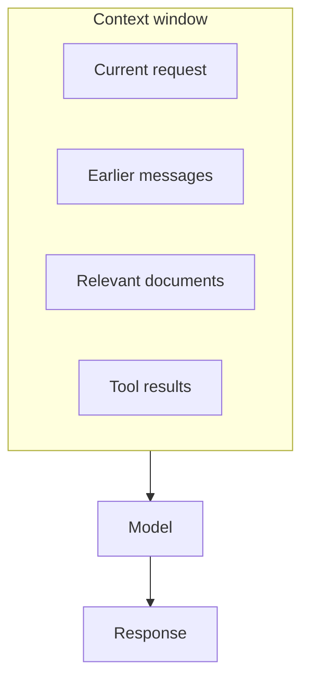
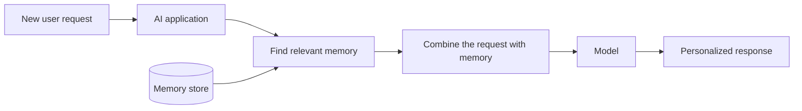
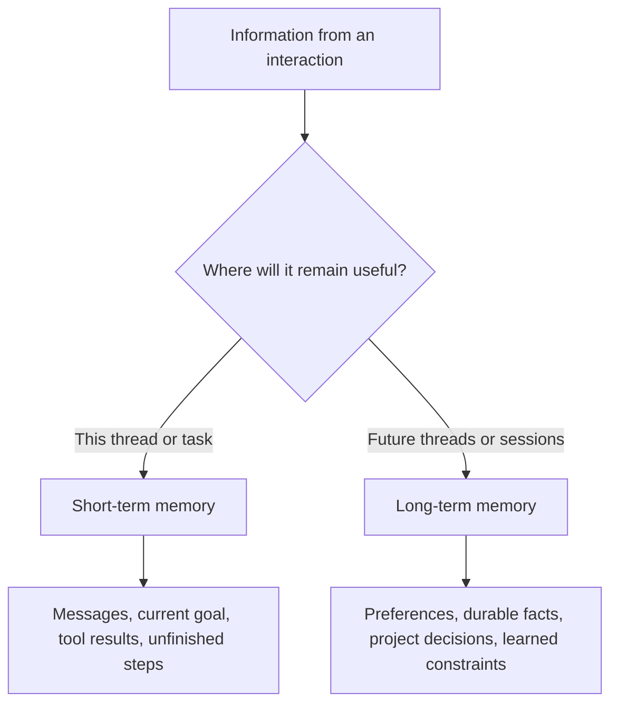
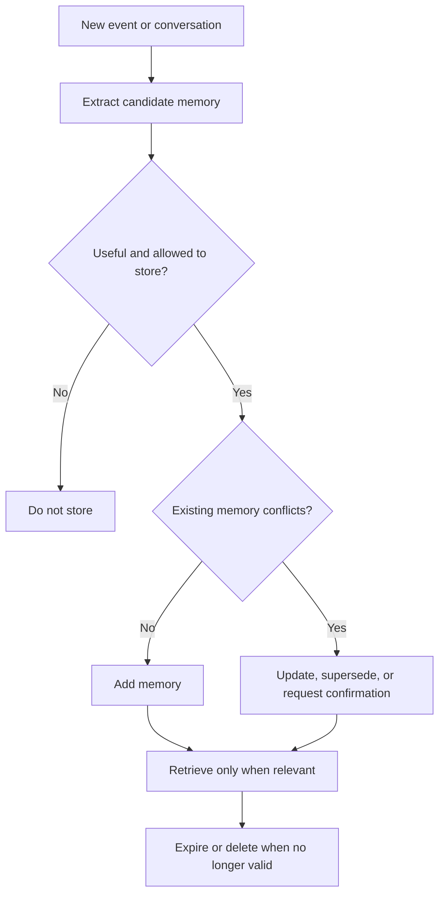
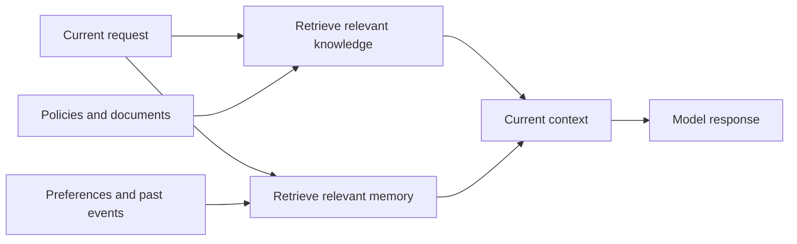
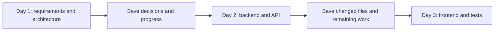
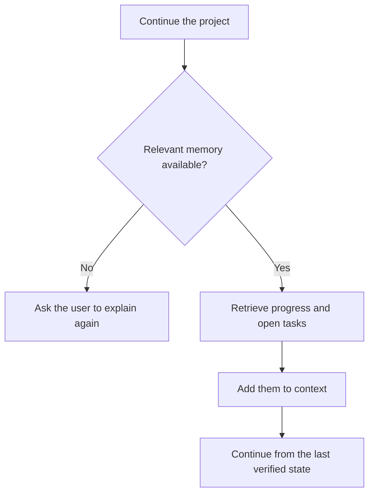
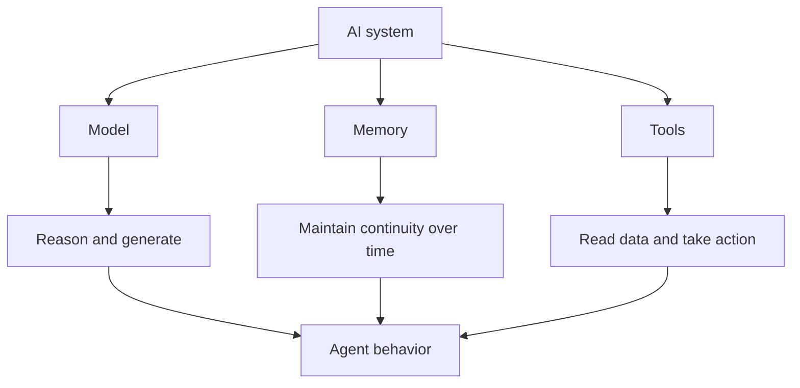

There is a familiar experience when working with AI.

You spend time explaining your project. You describe how you like reports to be written. You correct the assistant a few times. Eventually, it seems to understand you quite well.

Then you open a new conversation and have to say:

> "The project I am working on is..."

> "As I mentioned last time..."

> "No, that is not what I meant..."

This creates an interesting paradox:

> **An AI can solve a difficult problem, yet fail to remember something you told it yesterday.**

Why?

Because **intelligence and memory are different capabilities**.

## 1. A model does not remember a conversation the way a person does

When you talk to a friend, their memories do not disappear simply because the conversation ends.

A model call works differently. It receives a set of information, processes that information, and generates an output. The information available to the model at that moment is usually called its **context**.

You can imagine context as a worktable:

The model can use what is on the table. But the table has limits.

As a conversation grows, the application may need to keep some messages, summarize others, remove stale details, or begin with a fresh context. A new conversation does not automatically include everything from an old one unless the surrounding application stores that information and supplies it again.

So the first useful distinction is:

> **Context is what the model can see now. It is not automatically what the system will remember later.**

## 2. A context window is closer to a worktable than a permanent memory

Imagine solving a problem at a desk. You place the instructions, notes, calculator, and intermediate results in front of you.

While you are working, everything is convenient. But if the desk is cleared and you return tomorrow without leaving notes, much of that working state is gone.

An AI context window is similar. It is extremely useful for the work happening now, but it does not automatically become durable memory.

This is also why making a context window larger does not completely solve memory. More space allows the system to include more information, but introduces another question:

> **Among all the information available, what is actually important for the next decision?**

Long contexts can contain outdated messages, repeated tool output, and details that are technically related but no longer useful. Anthropic describes **context engineering** as the work of curating the right information for the model at the right time, not simply filling the context with as much data as possible.

Larger context is useful. Good selection is still necessary.

## 3. What does "memory" mean in an AI system?

A practical definition is:

> **Memory is a mechanism that stores information from the past and brings relevant parts back into context when they are needed.**

Suppose you tell an assistant:

> "I prefer concise reports with charts and do not need basic concepts explained."

The application may save a structured note such as:

- preferred length: concise;
- preferred format: charts first;
- assumed knowledge: skip basic explanations.

One week later, you ask it to analyze a sales report. Before calling the model, the application finds the relevant preference and adds it to the new context.

The model itself does not necessarily carry a personal memory of you from one independent call to the next.

**The system around the model creates continuity.**

That system may use a database, files, conversation checkpoints, summaries, embeddings, or a combination of them. Storage matters, but memory is not only storage. It also includes deciding what to save, when to retrieve it, and whether it should still be trusted.

## 4. Short-term memory and long-term memory

Agent systems commonly separate memory into two broad scopes.

### Short-term memory

Short-term memory keeps a conversation or active task coherent. It may contain:

- the current goal;
- steps already completed;
- recent tool results;
- decisions made earlier in the workflow;
- work that remains unfinished.

LangChain describes this as thread-scoped state. A checkpointer can persist that state so the same thread can resume later.

It resembles the notebook currently open on your desk.

### Long-term memory

Long-term memory stores information that may remain useful across separate conversations or sessions, such as:

- the user prefers short reports;
- the current project is called Project A;
- the team uses PostgreSQL;
- the team previously chose architecture X;
- a customer is prioritizing the Japanese market.

This resembles a notebook you can close today and reopen next week.

The boundary is determined by scope, not by the technology used to store the data. The same database could hold both kinds of information, while different policies decide who can access it and how long it should survive.

## 5. Saving everything does not create good memory

Imagine an assistant saving every sentence you have ever written.

After several years, it might contain thousands of conversations, outdated preferences, duplicate facts, superseded decisions, and contradictory statements.

If you ask, "How do I like reports formatted?", should it use what you said three years ago or what you changed last week?

Memory therefore involves more than storing data. A useful memory layer must answer:

- What is worth saving?
- Who or what does this memory belong to?
- When should it be retrieved?
- How confident are we that it is correct?
- Does new information replace an older memory?
- When should it expire or be deleted?

OpenAI has described long-term memory challenges at large scale in terms of staleness, correctness, and scalability. The lesson is simple: a good memory system sometimes needs to **forget well**.

## 6. How is memory different from RAG?

Memory and Retrieval-Augmented Generation, or RAG, are easy to mix up because both can retrieve information and place it in context.

The difference is usually their purpose and the kind of information they manage.

| | Knowledge base or RAG | Memory |
| --- | --- | --- |
| Typical content | Product docs, policies, manuals, reference material | Preferences, past actions, decisions, task history |
| Main question | "What does the source say?" | "What happened before, and what should carry forward?" |
| Example | "Refunds are allowed within 30 days." | "This customer requested a refund last week." |
| Typical scope | Shared organizational knowledge | User, thread, project, workspace, or agent |

A useful shorthand is:

> **A knowledge base helps AI know about the world.**

> **Memory helps AI carry forward what happened.**

The boundary is not absolute. Both systems may use databases, metadata, embeddings, or semantic search. In production, they may even share infrastructure. What differs is the lifecycle and meaning of the stored information.

## 7. Memory becomes more important when AI becomes an Agent

For an ordinary chatbot, forgetting may be annoying. You repeat a sentence and continue.

For an Agent working on a task for hours or days, forgetting can break the work.

Imagine a Coding Agent building an application:

If the second session does not know the architectural decisions from the first, it may continue in a completely different direction.

Anthropic compares this problem to engineers working in shifts when each incoming engineer has no memory of what the previous person did. Its long-running Agent work uses artifacts such as progress notes, feature lists, git history, and structured handoffs so a fresh session can reconstruct the state of the project.

This reveals an important idea:

> **Agent memory does not have to resemble a memory inside a brain. Sometimes it is simply good note-taking plus reliable retrieval.**

## 8. The same model can feel very different with better memory

Consider the request:

> "Continue the project from last time."

Without memory, the system may respond:

> "Could you provide more information about the project?"

With relevant memory, it may respond:

> "Last time we completed the API. Authentication and tests are still unfinished. Would you like to continue with authentication?"

The second experience does not necessarily require a smarter model. It may be the same model receiving better context.

This is why memory is becoming an important part of Agent architecture. The behavior users experience depends not only on the model, but also on how the surrounding system prepares context for every step.

## 9. Memory creates a sensitive question: how much should AI remember?

Long-term memory can make an assistant more useful, but it also raises questions about privacy, control, and consent.

Does the user actually want the system to remember:

- a formatting preference;
- a work project;
- a personal conversation;
- an old decision;
- information that is only valid for a few days?

A responsible memory system needs more than the ability to save information. It should also provide:

- clear memory scopes;
- user visibility and control;
- ways to correct or delete a memory;
- expiration rules for temporary information;
- access control between users, teams, and Agents;
- protection for sensitive data;
- an audit trail for important changes.

The stronger memory becomes, the more important this question becomes:

> **What is this AI allowed to remember, for whom, and for how long?**

## 10. Intelligence belongs to the model; continuity belongs to the system

A model may be able to write code, solve equations, read documents, and plan a project. But if the system does not return relevant information from the past, it can still behave as if:

> **"We have never met before."**

That is because model intelligence and system memory are different layers.

The model helps the system **reason**.

Tools help the system **act**.

Memory helps the system **remain coherent over time**.

When these layers work together, an Agent begins to feel less like a chatbot that exists for one conversation and more like a collaborator that can continue meaningful work.

The important question is no longer only:

> **"How intelligent is this AI?"**

It is also:

> **"What can it remember, for how long, and does it know when to forget?"**

## References

- [Anthropic - Effective context engineering for AI agents](https://www.anthropic.com/engineering/effective-context-engineering-for-ai-agents)
- [Anthropic - Effective harnesses for long-running agents](https://www.anthropic.com/engineering/effective-harnesses-for-long-running-agents)
- [LangChain - Memory overview](https://docs.langchain.com/oss/python/concepts/memory)
- [OpenAI - Dreaming: Better memory for a more helpful ChatGPT](https://openai.com/index/chatgpt-memory-dreaming/)
- [OpenAI Agents SDK - Context management](https://openai.github.io/openai-agents-python/context/)
